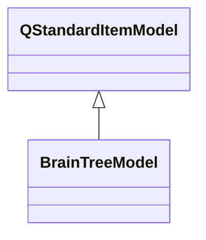

# BrainTreeModel

**Namespace:** `DISP3DLIB` &nbsp;·&nbsp; **Library:** 3D Display Library

`#include <disp3D/braintreemodel.h>`

```cpp
class DISP3DLIB::BrainTreeModel
```

Hierarchical item model organizing all 3-D scene objects (surfaces, sensors, sources, networks) for QTreeView.

### Inheritance



---

## Public Methods

### BrainTreeModel(parent)

---

### ~BrainTreeModel()

---

### addSurface(subject, hemi, surfType, surface)

---

### addAnnotation(subject, hemi, annotation)

---

### addBemSurface(subject, bemName, bemSurf)

---

### addSensors(type, items)

---

### addDipoles(set)

---

### addDigitizerData(digitizerPoints)

---

### addSourceSpace(srcSpace)

---

### addNetwork(network, name)

---

## Authors of this file

- Christoph Dinh &lt;christoph.dinh@mne-cpp.org&gt;
