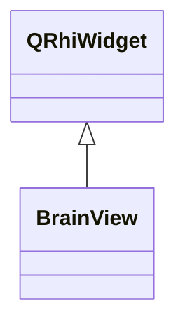

# BrainView

**Namespace:** `DISP3DLIB` &nbsp;·&nbsp; **Library:** 3D Display Library

`#include <disp3D/brainview.h>`

```cpp
class DISP3DLIB::BrainView
```

[`BrainView`](/docs/api/disp3-d/brain-view) is the main widget for the 3D brain visualization.

It handles user interaction, surface loading, and coordinates with the [`BrainRenderer`](/docs/api/disp3-d/brain-renderer).

Top-level QWidget hosting the QRhi-based 3-D brain visualization with mouse interaction and multi-view support.

### Inheritance



---

## Public Methods

### BrainView(parent)

Constructor.

**Parameters:**

- **parent** : *QWidget **
  Parent widget.

---

### ~BrainView()

Destructor.

---

### setModel(model)

Set the data model.

**Parameters:**

- **model** : *[BrainTreeModel](/docs/api/disp3-d/brain-tree-model) **
  Pointer to [`BrainTreeModel`](/docs/api/disp3-d/brain-tree-model).

---

### setInitialCameraRotation(rotation)

Set the initial camera rotation for this view.

Each view can start from a different orientation (e.g., top, front, left).

**Parameters:**

- **rotation** : *const QQuaternion &*
  Initial camera rotation quaternion.

---

## Authors of this file

- Christoph Dinh &lt;christoph.dinh@mne-cpp.org&gt;
