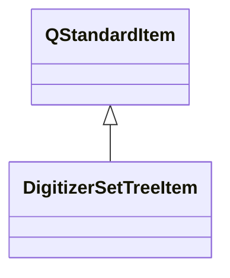

# DigitizerSetTreeItem

**Namespace:** `DISP3DLIB` &nbsp;·&nbsp; **Library:** 3D Display Library

`#include <disp3D/digitizersettreeitem.h>`

```cpp
class DISP3DLIB::DigitizerSetTreeItem
```

[`DigitizerSetTreeItem`](/docs/api/disp3-d/digitizer-set-tree-item) is a container item that groups digitizer points by category.

It parses a list of [FiffDigPoint](/docs/api/fiff/fiff-dig-point) entries and creates child [`DigitizerTreeItem`](/docs/api/disp3-d/digitizer-tree-item) instances for each category: Cardinal (Nasion, LPA, RPA), HPI, EEG, and Extra (head shape).

This matches the disp3D [`DigitizerSetTreeItem`](/docs/api/disp3-d/digitizer-set-tree-item) pattern, providing per-category color coding, sizing, and independent visibility control.

Category color scheme (matching disp3D):
Nasion: Green (0, 255, 0) — 2mm


LPA: Red (255, 0, 0) — 2mm


RPA: Blue (0, 0, 255) — 2mm


HPI: DarkRed (128, 0, 0) — 1mm


EEG: Cyan (0, 255, 255) — 1mm


Extra: Magenta (255, 0, 255) — 1mm

Digitizer point set container tree item.

### Inheritance



---

## Public Methods

### DigitizerSetTreeItem(text, digitizerPoints)

Constructs a [`DigitizerSetTreeItem`](/docs/api/disp3-d/digitizer-set-tree-item) from a list of FIFF digitizer points.

**Parameters:**

- **text** : *const QString &*
  Display text (e.g. "Digitizer").

- **digitizerPoints** : *const QList&lt; [FiffDigPoint](/docs/api/fiff/fiff-dig-point) &gt; &*
  List of FIFF digitizer points to categorize.

---

### ~DigitizerSetTreeItem()

---

### categoryItem(kind)

Returns the child [`DigitizerTreeItem`](/docs/api/disp3-d/digitizer-tree-item) for a given category, or nullptr.

**Parameters:**

- **kind** : *int*
  The digitizer point category to find.

**Returns:**

- *[DigitizerTreeItem](/docs/api/disp3-d/digitizer-tree-item) ** — Pointer to the child item, or nullptr if category has no points.

---

### totalPointCount()

Returns the total number of digitizer points across all categories.

**Returns:**

- *int* — Total point count.

---

## Authors of this file

- Christoph Dinh &lt;christoph.dinh@mne-cpp.org&gt;
