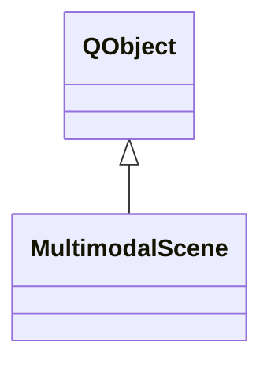

# MultimodalScene

**Namespace:** `DISP3DLIB` &nbsp;·&nbsp; **Library:** 3D Display Library

`#include <disp3D/multimodalscene.h>`

```cpp
class DISP3DLIB::MultimodalScene
```

Host-app-agnostic controller that owns the ordered renderable set and dispatches picks back to the producing layer.

Responsibilities:
Maintain an ordered registry of [`SceneLayer`](/docs/api/disp3-d/scene-layer) payloads keyed by id.


Emit `layersChanged` whenever a layer is added, removed, or its visibility/opacity flips, so the renderer can rebuild its draw list.


Maintain a shared timeline (current time index) that data overlays across modalities consume; emits `timeSampleChanged`.


Maintain the most recent [`PickResult`](/docs/api/disp3-d/pick-result) and emit `picked` when a layer producer reports a hit; consumers (Pick dock, status bar, MRI ortho viewer) subscribe to that signal.

The class is **non-virtual** on purpose: it is a pure data/dispatch hub with no rendering logic. The renderer (`[`[BrainRenderer](/docs/api/disp3-d/brain-renderer)`](/docs/api/disp3-d/brain-renderer)` or a future `MultimodalRenderer`) reads layers via `layers()` and per-kind downcasts the payload pointer.

```cpp title="src/examples/ex_disp3d_scene/main.cpp"
MultimodalScene scene;
scene.registerBoundsFn(SceneLayerKind::Electrode, [](const SceneLayer& layer, QVector3D& bbMin, QVector3D& bbMax) {
    const auto* object = static_cast<const ElectrodeObject*>(layer.payload.get());
    bbMin = bbMax = object->arrays().first().contacts.first().position;
    for (const ElectrodeContact& c : object->arrays().first().contacts) {
        bbMin = QVector3D(std::min(bbMin.x(), c.position.x()), std::min(bbMin.y(), c.position.y()), std::min(bbMin.z(), c.position.z()));
        bbMax = QVector3D(std::max(bbMax.x(), c.position.x()), std::max(bbMax.y(), c.position.y()), std::max(bbMax.z(), c.position.z()));
    }
    return true;
});
SceneLayer layer;
layer.id = "seeg_LH";
layer.kind = SceneLayerKind::Electrode;
auto payload = std::make_shared<ElectrodeObject>(); // owns GPU buffers, so it is not copyable
payload->setArrays(electrodes.arrays());
layer.payload = payload;
scene.addLayer(layer);
scene.setOverlayThresholds(2.0f, 4.0f, 8.0f);
QVector3D bbMin;
QVector3D bbMax;
scene.worldBounds(bbMin, bbMax); // union over visible layers with a bounds function
```

### Inheritance



---

## Public Methods

### MultimodalScene(parent)

---

### ~MultimodalScene()

---

### addLayer(layer)

Add or replace a layer.

If a layer with the same `SceneLayer::id` already exists, the stored layer is overwritten in place (preserving its slot in the draw order). Otherwise the new layer is appended to its kind's group.

**Parameters:**

- **layer** : *[SceneLayer](/docs/api/disp3-d/scene-layer)*
  Layer record. The caller retains ownership of the underlying payload via the shared_ptr.

---

### removeLayer(id)

Remove a layer by id.

**Parameters:**

- **id** : *const QString &*
  Layer id supplied to `addLayer`.

**Returns:**

- *bool* — true if a layer was removed, false if the id was unknown.

---

### clear()

Remove every layer.

---

### layers()

**Returns:**

- *QVector&lt; [SceneLayer](/docs/api/disp3-d/scene-layer) &gt;* — All layers in current draw order (sorted by kind, then by drawOrder, then by insertion order).

---

### findLayer(id)

**Parameters:**

- **id** : *const QString &*
  Layer id.

**Returns:**

- *const [SceneLayer](/docs/api/disp3-d/scene-layer) ** — Pointer to the layer with the given id, or nullptr. The pointer is valid only until the next mutation.

---

### setLayerVisible(id, visible)

Toggle visibility of a layer.

No-op if the id is unknown.

**Parameters:**

- **id** : *const QString &*
  Layer id.

- **visible** : *bool*
  True to show the layer, false to hide it.

---

### setLayerOpacity(id, opacity)

Set per-layer opacity in [0, 1].

No-op if the id is unknown.

**Parameters:**

- **id** : *const QString &*
  Layer id.

- **opacity** : *float*
  Opacity, clamped to [0, 1].

---

### currentTimeSample()

**Returns:**

- *int* — Current shared time index (used by data overlays). -1 if no time-resolved data is loaded.

---

### setCurrentTimeSample(sample)

Set the current time index.

Emits `timeSampleChanged` if it actually changes. Negative values are clamped to -1.

**Parameters:**

- **sample** : *int*
  New time sample index, or -1 for no time-resolved data.

---

### timeCursor()

**Returns:**

- *double* — Current shared time cursor in seconds. Independent of the integer-sample timeline (`currentTimeSample`) — overlay widgets that drive a continuous time slider operate in seconds. Default 0.

---

### setTimeCursor(seconds)

Set the shared time cursor in seconds.

Emits `timeCursorChanged` if the value actually changes.

**Parameters:**

- **seconds** : *double*
  New time cursor position in seconds.

---

### overlayFmin()

**Returns:**

- *float* — Current overlay min threshold. Default 0.

---

### overlayFmid()

**Returns:**

- *float* — Current overlay mid threshold. Default 0.5.

---

### overlayFmax()

**Returns:**

- *float* — Current overlay max threshold. Default 1.

---

### setOverlayThresholds(fmin, fmid, fmax)

Set the shared (fmin, fmid, fmax) overlay thresholds used by the data-driven Overlay dock and the renderables it drives.

The values are clamped to fmin &lt;= fmid &lt;= fmax. Emits `overlayThresholdsChanged` if any value actually changes.

**Parameters:**

- **fmin** : *float*
  Minimum threshold.

- **fmid** : *float*
  Mid threshold, raised to fmin if smaller.

- **fmax** : *float*
  Maximum threshold, raised to fmid if smaller.

---

### lastPick()

**Returns:**

- *const [PickResult](/docs/api/disp3-d/pick-result) &* — Most recent pick reported via `reportPick`. Default- constructed (kind == None) until the first hit.

---

### reportPick(pick)

[Report](/docs/api/utils/report) a pick result from a layer's renderer or hit-tester.

Emits `picked`. Used by both real ray-cast picking and synthetic picks (e.g. wizard "show this contact" navigation).

**Parameters:**

- **pick** : *const [PickResult](/docs/api/disp3-d/pick-result) &*
  Pick result to store as the last pick and broadcast.

---

### worldBounds(bbMin, bbMax)

Scene-wide axis-aligned bounding box union of all visible layers, computed by the supplied per-kind extractor.

The scene itself does not know how to read each payload type; the host registers extractors via `registerBoundsFn`.

**Parameters:**

- **bbMin** : *QVector3D &*
  Minimum corner of the union box; (-1, -1, -1) if no layer contributed.

- **bbMax** : *QVector3D &*
  Maximum corner of the union box; (1, 1, 1) if no layer contributed.

---

### registerBoundsFn(kind, fn)

Register an AABB extractor for a given layer kind.

Replaces any previously registered fn for that kind.

**Parameters:**

- **kind** : *SceneLayerKind*
  Layer kind the extractor handles.

- **fn** : *BoundsFn*
  Extractor returning false when the layer has no bounds.

---

## Example

- Full source: [`src/examples/ex_disp3d_scene/main.cpp`](https://github.com/mne-tools/mne-cpp/tree/staging/src/examples/ex_disp3d_scene/main.cpp)
- Build target: `ex_disp3d_scene` (runs under CTest)

## Authors of this file

- Christoph Dinh &lt;christoph.dinh@mne-cpp.org&gt;
