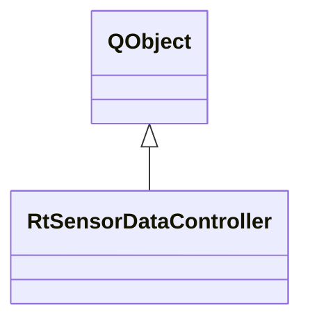

# RtSensorDataController

**Namespace:** `DISP3DLIB` &nbsp;·&nbsp; **Library:** 3D Display Library

`#include <disp3D/rtsensordatacontroller.h>`

```cpp
class DISP3DLIB::RtSensorDataController
```

[`RtSensorDataController`](/docs/api/disp3-d/rt-sensor-data-controller) orchestrates real-time sensor data streaming.

It manages a background data worker thread, a background interpolation matrix worker thread, and a timer that drives the data flow.

Unlike the source-estimate controller (which uses sparse interpolation matrices split by hemisphere), this controller uses a single dense mapping matrix produced by FieldMap::computeMeg/EegMapping() that maps sensor measurements directly to surface vertex values.

The controller can either accept a precomputed mapping matrix via `setMappingMatrix()`, or compute one on-the-fly in a background thread by providing evoked data, surface geometry, and transforms via the setInterpolationInfo() / `setEvoked()` / `setTransform()` methods. When parameters change, `recomputeMapping()` triggers an asynchronous recomputation; the new matrix is automatically forwarded to the data worker.

Usage:
Create controller


Either set mapping matrix via `setMappingMatrix()`, or configure interpolation parameters and call `recomputeMapping()`


Connect `newSensorColorsAvailable()` to your rendering update slot


Call `addData()` to push sensor measurement vectors


Call setStreamingState(true) to start streaming

Controller for real-time sensor data streaming.

### Inheritance



---

## Public Methods

### RtSensorDataController(parent)

Constructor.

Creates the worker and background thread.

**Parameters:**

- **parent** : *QObject **
  Parent QObject.

---

### ~RtSensorDataController()

Destructor.

Stops the worker thread and cleans up.

---

### addData(data)

Add a sensor measurement vector to the streaming queue.

The vector should contain one value per picked sensor channel (matching the mapping matrix column count).

**Parameters:**

- **data** : *const Eigen::VectorXf &*
  Sensor measurement vector (nChannels x 1).

---

### setMappingMatrix(surfaceKey, mat)

Set the dense mapping matrix (sensor → surface vertices).

Size: (nVertices × nChannels).

**Parameters:**

- **surfaceKey** : *const QString &*
  Key of the surface the matrix maps onto; colours are emitted for it.

- **mat** : *std::shared_ptr&lt; Eigen::MatrixXf &gt;*
  Dense mapping matrix.

---

### setStreamingState(state)

Start or stop the streaming.

**Parameters:**

- **state** : *bool*
  True to start, false to stop.

---

### isStreaming()

Check if streaming is active.

**Returns:**

- *bool* — True if streaming is running.

---

### setTimeInterval(msec)

Set the streaming interval (time between frames).

**Parameters:**

- **msec** : *int*
  Interval in milliseconds (default: 17ms ≈ 60fps).

---

### setNumberAverages(numAvr)

Set the number of samples to average before emitting.

**Parameters:**

- **numAvr** : *int*
  Number of averages (1 = no averaging).

---

### setColormapType(name)

Set the colormap type.

**Parameters:**

- **name** : *const QString &*
  Colormap name ("MNE", "Hot", "Jet", "Viridis", "Cool", "RedBlue").

---

### setThresholds(min, max)

Set explicit normalization thresholds for sensor data.

Pass min == 0 and max == 0 to re-enable symmetric auto-normalization.

**Parameters:**

- **min** : *double*
  Lower threshold.

- **max** : *double*
  Upper threshold.

---

### setLoopState(enabled)

Enable or disable looping (replay data when queue is exhausted).

**Parameters:**

- **enabled** : *bool*
  True to enable looping.

---

### setSFreq(sFreq)

Set the sampling frequency of the incoming data.

**Parameters:**

- **sFreq** : *double*
  Sampling frequency in Hz.

---

### clearData()

Clear all queued data and reset the worker state.

---

### setStreamSmoothedData(bStreamSmoothedData)

Toggle between emitting per-vertex color data (smoothed) and raw sensor values.

**Parameters:**

- **bStreamSmoothedData** : *bool*
  True for smoothed colors (default), false for raw.

---

### setEvoked(evoked)

Set the evoked data that contains channel info and sensor definitions.

This configures the interpolation worker for on-the-fly recomputation.

**Parameters:**

- **evoked** : *const [FiffEvoked](/docs/api/fiff/fiff-evoked) &*
  The evoked dataset.

---

### setTransform(trans, applySensorTrans)

Set the head-to-MRI coordinate transform for the interpolation worker.

**Parameters:**

- **trans** : *const [FiffCoordTrans](/docs/api/fiff/fiff-coord-trans) &*
  The transform.

- **applySensorTrans** : *bool*
  Whether to apply the transform.

---

### setMegFieldMapOnHead(onHead)

Set whether the MEG field should be mapped onto the head (BEM) surface rather than the helmet surface.

**Parameters:**

- **onHead** : *bool*
  True to map onto head.

---

### setMegSurface(surfaceKey, vertices, normals, triangles)

Set the MEG target surface geometry for on-the-fly mapping.

**Parameters:**

- **surfaceKey** : *const QString &*
  The key identifying the surface.

- **vertices** : *const Eigen::MatrixX3f &*
  Vertex positions (nVerts x 3).

- **normals** : *const Eigen::MatrixX3f &*
  Vertex normals (nVerts x 3).

- **triangles** : *const Eigen::MatrixX3i &*
  Triangle indices (nTris x 3).

---

### setEegSurface(surfaceKey, vertices)

Set the EEG target surface geometry for on-the-fly mapping.

**Parameters:**

- **surfaceKey** : *const QString &*
  The key identifying the surface.

- **vertices** : *const Eigen::MatrixX3f &*
  Vertex positions (nVerts x 3).

---

### setBadChannels(bads)

Set bad channels for the interpolation worker.

**Parameters:**

- **bads** : *const QStringList &*
  List of bad channel names.

---

### recomputeMapping()

Trigger an asynchronous recomputation of the mapping matrix.

The new matrix will be automatically forwarded to the data worker when ready.

---

## Authors of this file

- Christoph Dinh &lt;christoph.dinh@mne-cpp.org&gt;
