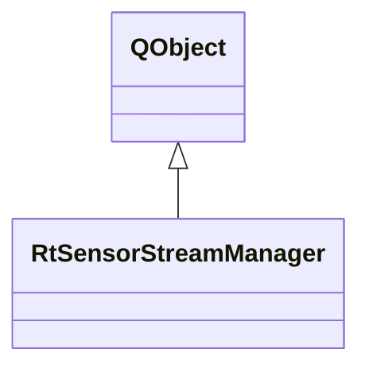

# RtSensorStreamManager

**Namespace:** `DISP3DLIB` &nbsp;·&nbsp; **Library:** 3D Display Library

`#include <disp3D/rtsensorstreammanager.h>`

```cpp
class DISP3DLIB::RtSensorStreamManager
```

Manages real-time sensor data streaming via [`RtSensorDataController`](/docs/api/disp3-d/rt-sensor-data-controller).

[`BrainView`](/docs/api/disp3-d/brain-view) delegates all sensor streaming operations to this component, keeping its own code free of the [`RtSensorDataController`](/docs/api/disp3-d/rt-sensor-data-controller) lifecycle.

Real-time sensor streaming lifecycle manager.

### Inheritance



---

## Public Methods

### RtSensorStreamManager(parent)

Constructor.

**Parameters:**

- **parent** : *QObject **
  Parent QObject.

---

### ~RtSensorStreamManager()

Destructor.

---

### startStreaming(modality, fieldMapper, surfaces)

Start real-time sensor streaming for the given modality.

Reads mapping matrices, pick vectors, evoked data, and colourmap from the provided `fieldMapper`. Validates that the target surface key exists in `surfaces`.

**Parameters:**

- **modality** : *const QString &*
  "MEG" or "EEG".

- **fieldMapper** : *const [SensorFieldMapper](/docs/api/disp3-d/sensor-field-mapper) &*
  Sensor-field mapper with built mapping data.

- **surfaces** : *const QMap&lt; QString, std::shared_ptr&lt; [BrainSurface](/docs/api/disp3-d/brain-surface) &gt; &gt; &*
  FsSurface map for target-surface validation.

**Returns:**

- *bool* — true if streaming was started successfully.

---

### stopStreaming()

Stop real-time sensor streaming.

---

### isStreaming()

**Returns:**

- *bool* — true while real-time sensor streaming is active.

---

### modality()

**Returns:**

- *QString* — the active modality ("MEG" or "EEG"), or empty.

---

### pushData(data)

Push a single measurement vector into the streaming queue.

**Parameters:**

- **data** : *const Eigen::VectorXf &*
  One sample of sensor values; ignored if no controller exists.

---

### setInterval(msec)

Set the streaming playback interval in milliseconds.

**Parameters:**

- **msec** : *int*
  Interval between streamed samples in milliseconds.

---

### setLooping(enabled)

Enable or disable looping of the streaming queue.

**Parameters:**

- **enabled** : *bool*
  True to replay the queue from the start when it ends.

---

### setAverages(numAvr)

Set the number of averages for smoothing.

**Parameters:**

- **numAvr** : *int*
  Number of consecutive samples averaged per frame.

---

### setColormap(name)

Set the colormap used for colour mapping.

**Parameters:**

- **name** : *const QString &*
  Colormap name (e.g. "MNE", "Jet").

---

## Authors of this file

- Christoph Dinh &lt;christoph.dinh@mne-cpp.org&gt;
