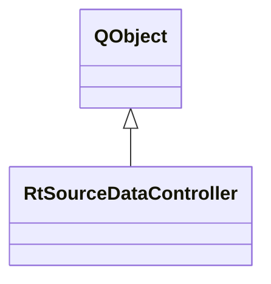

# RtSourceDataController

**Namespace:** `DISP3DLIB` &nbsp;·&nbsp; **Library:** 3D Display Library

`#include <disp3D/rtsourcedatacontroller.h>`

```cpp
class DISP3DLIB::RtSourceDataController
```

[`RtSourceDataController`](/docs/api/disp3-d/rt-source-data-controller) orchestrates real-time source estimate streaming.

It manages a background data worker thread, an optional background interpolation matrix worker thread, and a timer that drives the data flow.

The controller provides a simple public API for:
Pushing new source estimate data


Setting interpolation matrices (LH/RH) directly or triggering on-the-fly recomputation when parameters change


Configuring streaming parameters (speed, looping, averaging)


Configuring visualization parameters (colormap, thresholds)


Starting/stopping the streaming

On-the-fly recomputation:
Set surface/source geometry via setInterpolationInfoLeft/Right()


Configure interpolation function and cancel distance via `setInterpolationFunction()` / `setCancelDistance()`


Call `recomputeInterpolation()` to trigger background computation


The new matrices are automatically forwarded to the data worker

Usage:
Create controller


Set interpolation matrices via setInterpolationMatrixLeft/Right()


Connect `newSmoothedDataAvailable()` to your rendering update slot


Call `addData()` to push source estimate vectors


Call setStreamingState(true) to start streaming

Controller for real-time source estimate streaming.

### Inheritance



---

## Public Methods

### RtSourceDataController(parent)

Constructor.

Creates the worker and background thread.

**Parameters:**

- **parent** : *QObject **
  Parent QObject.

---

### ~RtSourceDataController()

Destructor.

Stops the worker thread and cleans up.

---

### addData(data)

Add a source estimate data vector to the streaming queue.

The vector should contain source values for all sources (LH + RH concatenated).

**Parameters:**

- **data** : *const Eigen::VectorXd &*
  Source activity vector (nSourcesLH + nSourcesRH).

---

### setInterpolationMatrixLeft(mat)

Set the interpolation matrix for the left hemisphere.

**Parameters:**

- **mat** : *QSharedPointer&lt; Eigen::SparseMatrix&lt; float &gt; &gt;*
  Sparse interpolation matrix (nVerticesLH x nSourcesLH).

---

### setInterpolationMatrixRight(mat)

Set the interpolation matrix for the right hemisphere.

**Parameters:**

- **mat** : *QSharedPointer&lt; Eigen::SparseMatrix&lt; float &gt; &gt;*
  Sparse interpolation matrix (nVerticesRH x nSourcesRH).

---

### setStreamingState(state)

Start or stop the streaming.

**Parameters:**

- **state** : *bool*
  True to start, false to stop.

---

### isStreaming()

Check if streaming is active.

**Returns:**

- *bool* — True if streaming is running.

---

### setTimeInterval(msec)

Set the streaming interval (time between frames).

**Parameters:**

- **msec** : *int*
  Interval in milliseconds (default: 17ms ≈ 60fps).

---

### setNumberAverages(numAvr)

Set the number of samples to average before emitting.

**Parameters:**

- **numAvr** : *int*
  Number of averages (1 = no averaging).

---

### setColormapType(name)

Set the colormap type.

**Parameters:**

- **name** : *const QString &*
  Colormap name ("Hot", "Jet", "Viridis", "Cool", "RedBlue").

---

### setThresholds(min, mid, max)

Set the normalization thresholds.

**Parameters:**

- **min** : *double*
  Lower threshold.

- **mid** : *double*
  Mid-point threshold.

- **max** : *double*
  Upper threshold.

---

### setLoopState(enabled)

Enable or disable looping (replay data when queue is exhausted).

**Parameters:**

- **enabled** : *bool*
  True to enable looping.

---

### setSFreq(sFreq)

Set the sampling frequency of the incoming data.

**Parameters:**

- **sFreq** : *double*
  Sampling frequency in Hz.

---

### clearData()

Clear all queued data and reset the worker state.

---

### setSurfaceColor(baseColorsLh, baseColorsRh)

Set the base surface colors for both hemispheres.

Sub-threshold vertices will display these colors (e.g., curvature or annotation coloring) instead of being transparent.

**Parameters:**

- **baseColorsLh** : *const QVector&lt; uint32_t &gt; &*
  Per-vertex ABGR colors for the left hemisphere.

- **baseColorsRh** : *const QVector&lt; uint32_t &gt; &*
  Per-vertex ABGR colors for the right hemisphere.

---

### setStreamSmoothedData(bStreamSmoothedData)

Toggle between emitting interpolated color data (smoothed) and raw source values split by hemisphere.

**Parameters:**

- **bStreamSmoothedData** : *bool*
  True for smoothed colors (default), false for raw.

---

### setInterpolationFunction(sInterpolationFunction)

Set the interpolation function for on-the-fly matrix computation.

**Parameters:**

- **sInterpolationFunction** : *const QString &*
  Function name ("linear", "gaussian", "square", "cubic").

---

### setCancelDistance(dCancelDist)

Set the cancel distance for on-the-fly matrix computation.

Distances larger than this are ignored in the interpolation.

**Parameters:**

- **dCancelDist** : *double*
  Cancel distance in meters.

---

### setInterpolationInfoLeft(matVertices, vecNeighborVertices, vecSourceVertices)

Set the surface and source geometry for the left hemisphere.

Used for on-the-fly interpolation matrix computation.

**Parameters:**

- **matVertices** : *const Eigen::MatrixX3f &*
  Vertex positions (nVerts x 3).

- **vecNeighborVertices** : *const std::vector&lt; Eigen::VectorXi &gt; &*
  Per-vertex neighbor index lists.

- **vecSourceVertices** : *const Eigen::VectorXi &*
  Source vertex indices into the surface.

---

### setInterpolationInfoRight(matVertices, vecNeighborVertices, vecSourceVertices)

Set the surface and source geometry for the right hemisphere.

Used for on-the-fly interpolation matrix computation.

**Parameters:**

- **matVertices** : *const Eigen::MatrixX3f &*
  Vertex positions (nVerts x 3).

- **vecNeighborVertices** : *const std::vector&lt; Eigen::VectorXi &gt; &*
  Per-vertex neighbor index lists.

- **vecSourceVertices** : *const Eigen::VectorXi &*
  Source vertex indices into the surface.

---

### recomputeInterpolation()

Trigger an asynchronous recomputation of the interpolation matrices.

The new matrices will be automatically forwarded to the data worker.

---

### setVisualizationType(iVisType)

Set the visualization type (interpolation-based or annotation-based).

**Parameters:**

- **iVisType** : *int*
  0 = InterpolationBased, 1 = AnnotationBased.

---

### setAnnotationInfoLeft(vecLabelIds, lLabels, vecVertNo)

Set annotation info for the left hemisphere.

**Parameters:**

- **vecLabelIds** : *const Eigen::VectorXi &*
  Per-vertex label IDs.

- **lLabels** : *const QList&lt; [FsLabel](/docs/api/fs/fs-label) &gt; &*
  FreeSurfer Labels.

- **vecVertNo** : *const Eigen::VectorXi &*
  Source vertex numbers.

---

### setAnnotationInfoRight(vecLabelIds, lLabels, vecVertNo)

Set annotation info for the right hemisphere.

**Parameters:**

- **vecLabelIds** : *const Eigen::VectorXi &*
  Per-vertex label IDs.

- **lLabels** : *const QList&lt; [FsLabel](/docs/api/fs/fs-label) &gt; &*
  FreeSurfer Labels.

- **vecVertNo** : *const Eigen::VectorXi &*
  Source vertex numbers.

---

## Authors of this file

- Christoph Dinh &lt;christoph.dinh@mne-cpp.org&gt;
