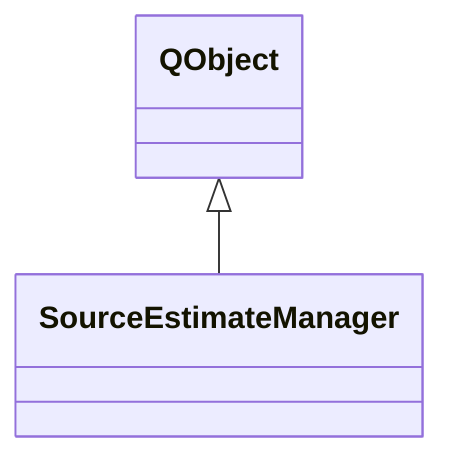

# SourceEstimateManager

**Namespace:** `DISP3DLIB` &nbsp;·&nbsp; **Library:** 3D Display Library

`#include <disp3D/sourceestimatemanager.h>`

```cpp
class DISP3DLIB::SourceEstimateManager
```

Manages source estimate data: async loading, time-point navigation, colormap/threshold control, and real-time streaming via [`RtSourceDataController`](/docs/api/disp3-d/rt-source-data-controller).

[`BrainView`](/docs/api/disp3-d/brain-view) delegates all source-estimate operations to this component, keeping its own code free of STC lifecycle details.

Source estimate lifecycle manager.

### Inheritance



---

## Public Methods

### SourceEstimateManager(parent)

Constructor.

**Parameters:**

- **parent** : *QObject **
  Parent QObject.

---

### ~SourceEstimateManager()

Destructor.

---

### load(lhPath, rhPath, surfaces, activeSurfaceType)

Start async STC file loading on a background thread.

**Parameters:**

- **lhPath** : *const QString &*
  Path to left-hemisphere STC file.

- **rhPath** : *const QString &*
  Path to right-hemisphere STC file.

- **surfaces** : *const QMap&lt; QString, std::shared_ptr&lt; [BrainSurface](/docs/api/disp3-d/brain-surface) &gt; &gt; &*
  FsSurface map for finding lh/rh brain surfaces.

- **activeSurfaceType** : *const QString &*
  Active surface type name (e.g. "pial").

**Returns:**

- *bool* — true if loading was started, false on error.

---

### cancelLoading()

Cancel any in-progress STC loading / interpolation and wait for the thread to finish.

---

### isLoading()

**Returns:**

- *bool* — true while an async STC load is in progress.

---

### isLoaded()

**Returns:**

- *bool* — true if source estimate data has been loaded successfully.

---

### setTimePoint(index, surfaces, singleView, subViews)

Set the current STC time-point and apply colours to matching surfaces.

**Parameters:**

- **index** : *int*
  Time-point index.

- **surfaces** : *const QMap&lt; QString, std::shared_ptr&lt; [BrainSurface](/docs/api/disp3-d/brain-surface) &gt; &gt; &*
  FsSurface map.

- **singleView** : *const [SubView](/docs/api/disp3-d/sub-view) &*
  Single-view state (for active surface type).

- **subViews** : *const QVector&lt; [SubView](/docs/api/disp3-d/sub-view) &gt; &*
  Multi-view states.

---

### currentTimePoint()

**Returns:**

- *int* — current time-point index.

---

### tstep()

**Returns:**

- *float* — time step between STC samples (seconds), or 0.

---

### tmin()

**Returns:**

- *float* — start time of the STC data (seconds), or 0.

---

### numTimePoints()

**Returns:**

- *int* — number of time points, or 0.

---

### closestIndex(timeSec)

**Parameters:**

- **timeSec** : *float*
  Time in seconds.

**Returns:**

- *int* — index closest to `timeSec`, or -1.

---

### setColormap(name)

Set the colormap used for source estimate visualisation.

**Parameters:**

- **name** : *const QString &*
  Colormap name (e.g. "Hot", "Jet").

---

### setThresholds(min, mid, max)

Set source estimate thresholds.

**Parameters:**

- **min** : *float*
  Minimum threshold.

- **mid** : *float*
  Mid threshold.

- **max** : *float*
  Maximum threshold.

---

### startStreaming(surfaces, singleView, subViews)

Start real-time playback.

Feeds all STC time-points into the streaming queue and begins the interpolation pipeline.

**Parameters:**

- **surfaces** : *const QMap&lt; QString, std::shared_ptr&lt; [BrainSurface](/docs/api/disp3-d/brain-surface) &gt; &gt; &*
  FsSurface map (for colour application).

- **singleView** : *const [SubView](/docs/api/disp3-d/sub-view) &*
  Single-view state.

- **subViews** : *const QVector&lt; [SubView](/docs/api/disp3-d/sub-view) &gt; &*
  Multi-view states.

---

### stopStreaming()

Stop real-time streaming.

---

### isStreaming()

**Returns:**

- *bool* — true while real-time streaming is active.

---

### pushData(data)

Push a single column of source data into the streaming queue.

**Parameters:**

- **data** : *const Eigen::VectorXd &*
  Source amplitudes for one time point; ignored if no controller exists.

---

### setInterval(msec)

Set the streaming playback interval in milliseconds.

**Parameters:**

- **msec** : *int*
  Interval between streamed time points in milliseconds.

---

### setLooping(enabled)

Enable or disable looping of the streaming queue.

**Parameters:**

- **enabled** : *bool*
  True to replay the queue from the start when it ends.

---

### overlay()

**Returns:**

- *const [SourceEstimateOverlay](/docs/api/disp3-d/source-estimate-overlay) ** — read-only pointer to the overlay (may be null).

---

## Authors of this file

- Christoph Dinh &lt;christoph.dinh@mne-cpp.org&gt;
