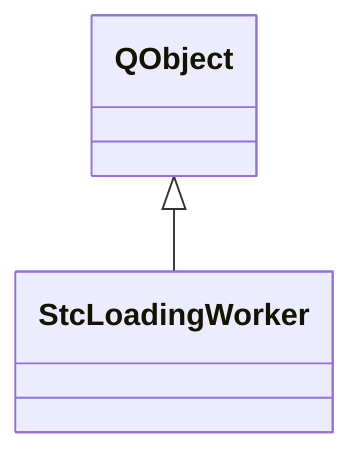

# StcLoadingWorker

**Namespace:** `DISP3DLIB` &nbsp;·&nbsp; **Library:** 3D Display Library

`#include <disp3D/stcloadingworker.h>`

```cpp
class DISP3DLIB::StcLoadingWorker
```

[`StcLoadingWorker`](/docs/api/disp3-d/stc-loading-worker) performs source estimate loading and interpolation matrix computation in a background thread to avoid blocking the UI.

Background worker that loads source estimate (STC) files and emits loaded data for visualization.

### Inheritance



---

## Public Methods

### StcLoadingWorker(lhPath, rhPath, lhSurface, rhSurface, cancelDist, parent)

Constructor.

**Parameters:**

- **lhPath** : *const QString &*
  Path to left hemisphere STC file.

- **rhPath** : *const QString &*
  Path to right hemisphere STC file.

- **lhSurface** : *[BrainSurface](/docs/api/disp3-d/brain-surface) **
  Pointer to left hemisphere surface.

- **rhSurface** : *[BrainSurface](/docs/api/disp3-d/brain-surface) **
  Pointer to right hemisphere surface.

- **cancelDist** : *double*
  Cancel distance for interpolation.

- **parent** : *QObject **
  Parent object.

---

### ~StcLoadingWorker()

Destructor.

---

### stcLh()

Get the loaded left hemisphere source estimate.

**Returns:**

- *const [InvSourceEstimate](/docs/api/inv/inv-source-estimate) &* — The left hemisphere source estimate.

---

### stcRh()

Get the loaded right hemisphere source estimate.

**Returns:**

- *const [InvSourceEstimate](/docs/api/inv/inv-source-estimate) &* — The right hemisphere source estimate.

---

### interpolationMatLh()

Get the computed left hemisphere interpolation matrix.

**Returns:**

- *QSharedPointer&lt; Eigen::SparseMatrix&lt; float &gt; &gt;* — Shared pointer to the interpolation matrix.

---

### interpolationMatRh()

Get the computed right hemisphere interpolation matrix.

**Returns:**

- *QSharedPointer&lt; Eigen::SparseMatrix&lt; float &gt; &gt;* — Shared pointer to the interpolation matrix.

---

### hasLh()

Check if left hemisphere data was loaded.

**Returns:**

- *bool* — True if LH data is loaded.

---

### hasRh()

Check if right hemisphere data was loaded.

**Returns:**

- *bool* — True if RH data is loaded.

---

### requestCancel()

Request cancellation of the current loading/interpolation.

Thread-safe; takes effect at the next progress check.

---

### isCancelled()

**Returns:**

- *bool* — true if cancellation has been requested.

---

## Authors of this file

- Christoph Dinh &lt;christoph.dinh@mne-cpp.org&gt;
