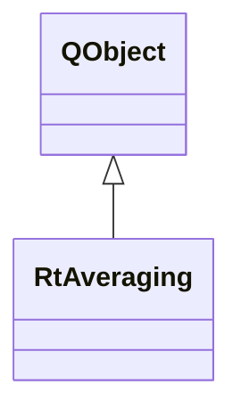

# RtAveraging

**Namespace:** `RTPROCESSINGLIB` &nbsp;·&nbsp; **Library:** DSP Library

`#include <dsp/rt_averaging.h>`

```cpp
class RTPROCESSINGLIB::RtAveraging
```

Real-time averaging.

Controller that manages [`RtAveragingWorker`](/docs/api/dsp/rt-averaging-worker) for online epoch averaging with baseline correction.

```cpp title="src/examples/ex_dsp_rt/main.cpp"
RtAveraging threaded(10, 20, 80, 0, 0, 2, info); // owns the worker thread
bool averaged = false;
QObject::connect(&threaded, &RtAveraging::evokedStim,
                 [&](const FiffEvokedSet& set, const QStringList&) { averaged = set.evoked.first().nave == nBlocks; });
for (const MatrixXd& block : blocks) {
    threaded.append(block);
}
```

### Inheritance



---

## Public Methods

### RtAveraging(numAverages, iPreStimSamples, iPostStimSamples, iBaselineFromSecs, iBaselineToSecs, iTriggerIndex, pFiffInfo, parent)

Creates the real-time averaging object.

**Parameters:**

- **numAverages** : *quint32*
  Number of evkos to average.

- **iPreStimSamples** : *quint32*
  Number of samples averaged before the stimulus.

- **iPostStimSamples** : *quint32*
  Number of samples averaged after the stimulus (including the stimulus).

- **iBaselineFromSecs** : *quint32*
  Start of baseline area which was/is used for correction in msecs.

- **iBaselineToSecs** : *quint32*
  End of baseline area which was/is used for correction in msecs.

- **iTriggerIndex** : *quint32*
  Row in dex of channel which is to be scanned for triggers.

- **pFiffInfo** : *[FIFFLIB::FiffInfo](/docs/api/fiff/fiff-info)::SPtr*
  Associated Fiff Information.

- **parent** : *QObject **
  Parent QObject (optional).

---

### ~RtAveraging()

Destroys the real-time averaging object.

---

### append(data)

Slot to receive incoming data.

**Parameters:**

- **data** : *const Eigen::MatrixXd &*
  Data to calculate the average from.

---

### restart(numAverages, iPreStimSamples, iPostStimSamples, iBaselineFromSecs, iBaselineToSecs, iTriggerIndex, pFiffInfo)

Restarts the thread by interrupting its computation queue, quitting, waiting and then starting it again.

**Parameters:**

- **numAverages** : *quint32*
  Number of evkos to average.

- **iPreStimSamples** : *quint32*
  Number of samples averaged before the stimulus.

- **iPostStimSamples** : *quint32*
  Number of samples averaged after the stimulus (including the stimulus).

- **iBaselineFromSecs** : *quint32*
  Start of baseline area which was/is used for correction in msecs.

- **iBaselineToSecs** : *quint32*
  End of baseline area which was/is used for correction in msecs.

- **iTriggerIndex** : *quint32*
  Row in dex of channel which is to be scanned for triggers.

- **pFiffInfo** : *[FIFFLIB::FiffInfo](/docs/api/fiff/fiff-info)::SPtr*
  Associated Fiff Information.

---

### stop()

Stops the thread by interrupting its computation queue, quitting and waiting.

---

### setAverageNumber(numAve)

Sets the number of averages.

**Parameters:**

- **numAve** : *qint32*
  new number of averages.

---

### setPreStim(samples, secs)

Sets the number of pre stimulus samples.

**Parameters:**

- **samples** : *qint32*
  new number of pre stimulus samples.

- **secs** : *qint32*
  new number of pre stimulus seconds.

---

### setPostStim(samples, secs)

Sets the number of post stimulus samples.

**Parameters:**

- **samples** : *qint32*
  new number of post stimulus samples.

- **secs** : *qint32*
  new number of pre stimulus seconds.

---

### setTriggerChIndx(idx)

Sets the index of the trigger channel which is to be scanned fo triggers.

**Parameters:**

- **idx** : *qint32*
  trigger channel index.

---

### setArtifactReduction(mapThresholds)

Sets the artifact reduction.

**Parameters:**

- **mapThresholds** : *const QMap&lt; QString, double &gt; &*
  The new map including the current thresholds for the channels.

---

### setBaselineActive(activate)

Sets the baseline correction on or off.

**Parameters:**

- **activate** : *bool*
  activate baseline correction.

---

### setBaselineFrom(fromSamp, fromMSec)

Sets the from mSeconds of the baseline area.

**Parameters:**

- **fromSamp** : *int*
  from of baseline area in samples.

- **fromMSec** : *int*
  from of baseline area in mSeconds.

---

### setBaselineTo(toSamp, toMSec)

Sets the to mSeconds of the baseline area.

**Parameters:**

- **toSamp** : *int*
  to of baseline area in samples.

- **toMSec** : *int*
  to of baseline area in mSeconds.

---

### reset()

Reset the data processing in the real-time worker.

---

## Example

- Full source: [`src/examples/ex_dsp_rt/main.cpp`](https://github.com/mne-tools/mne-cpp/tree/staging/src/examples/ex_dsp_rt/main.cpp)
- Build target: `ex_dsp_rt` (runs under CTest)
- Data: [mne-cpp-test-data](https://github.com/mne-tools/mne-cpp-test-data)

## Authors of this file

- Christoph Dinh &lt;christoph.dinh@mne-cpp.org&gt;
