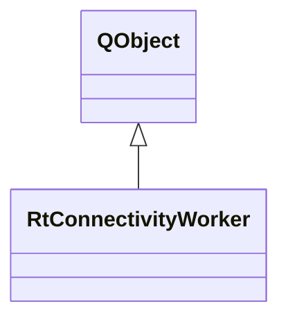

# RtConnectivityWorker

**Namespace:** `RTPROCESSINGLIB` &nbsp;·&nbsp; **Library:** DSP Library

`#include <dsp/rt_connectivity.h>`

```cpp
class RTPROCESSINGLIB::RtConnectivityWorker
```

Real-time connectivity worker.

Background worker thread that computes functional connectivity metrics in real time.

```cpp title="src/examples/ex_dsp_rt/main.cpp"
RtConnectivity rtConnectivity;
MatrixXd online;
bool connectivityDone = false;
QObject::connect(&rtConnectivity, &RtConnectivity::newConnectivityResultAvailable,
                 [&](const QList<Network>& networks, const ConnectivitySettings&) {
                     online = networks.first().getFullConnectivityMatrix();
                     connectivityDone = true;
                 });
rtConnectivity.append(settings); // computed on the worker thread
```

### Inheritance



---

## Public Methods

### doWork(connectivitySettings)

Perform actual connectivity estimation.

**Parameters:**

- **connectivitySettings** : *const [ConnectivitySettings](/docs/api/connectivity/connectivity-settings) &*
  The connectivity settings to be used during connectivity estimation.

---

## Example

- Full source: [`src/examples/ex_dsp_rt/main.cpp`](https://github.com/mne-tools/mne-cpp/tree/staging/src/examples/ex_dsp_rt/main.cpp)
- Build target: `ex_dsp_rt` (runs under CTest)
- Data: [mne-cpp-test-data](https://github.com/mne-tools/mne-cpp-test-data)

## Authors of this file

- Christoph Dinh &lt;christoph.dinh@mne-cpp.org&gt;
