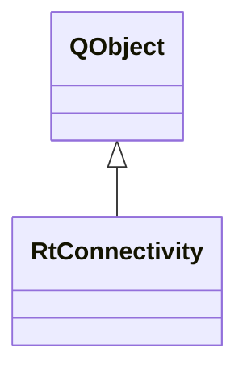

# RtConnectivity

**Namespace:** `RTPROCESSINGLIB` &nbsp;·&nbsp; **Library:** DSP Library &nbsp;·&nbsp; **Source:** [`dsp/rt/rt_connectivity.h`](https://github.com/mne-tools/mne-cpp/blob/staging/src/libraries/dsp/rt/rt_connectivity.h)

`#include <dsp/rt_connectivity.h>`

<Connections topics={["real-time"]} context="api" current="RtConnectivity" />

```cpp
class RTPROCESSINGLIB::RtConnectivity
```

Real-time connectivity estimation.

Controller that manages [`RtConnectivityWorker`](/docs/api/dsp/rt-connectivity-worker) for online connectivity computation.

```cpp title="src/examples/ex_dsp_rt/main.cpp"
RtConnectivity rtConnectivity;
MatrixXd online;
bool connectivityDone = false;
QObject::connect(&rtConnectivity, &RtConnectivity::newConnectivityResultAvailable,
                 [&](const QList<Network>& networks, const ConnectivitySettings&) {
                     online = networks.first().getFullConnectivityMatrix();
                     connectivityDone = true;
                 });
rtConnectivity.append(settings); // computed on the worker thread
```

### Inheritance


```mermaid
classDiagram
    QObject <|-- RtConnectivity
```

---

## Public Methods

### RtConnectivity(parent)

Creates the real-time connectivity estimation object.

**Parameters:**

- **parent** : *QObject **
  Parent QObject (optional).

---

### ~RtConnectivity()

Destroys the real-time connectivity estimation object.

---

### append(connectivitySettings)

Slot to receive incoming data.

**Parameters:**

- **connectivitySettings** : *const [ConnectivitySettings](/docs/api/connectivity/connectivity-settings) &*
  Data to estimate the connectivity from.

---

### restart()

Restarts the thread by interrupting its computation queue, quitting, waiting and then starting it again.

---

### stop()

Stops the thread by interrupting its computation queue, quitting and waiting.

---

## Example

- Start here: [ex_dsp_rt](../../examples/dsp/ex_dsp_rt.mdx) — DSP real-time workers: averaging, covariance, noise spectrum, connectivity, HPI fitting and inverse operators.
- Full source: [`src/examples/ex_dsp_rt/main.cpp`](https://github.com/mne-tools/mne-cpp/tree/staging/src/examples/ex_dsp_rt/main.cpp)
- Build target: `ex_dsp_rt` (runs under CTest)
- Data: [mne-cpp-test-data](https://github.com/mne-tools/mne-cpp-test-data)

## Used in examples

### [ex_connectivity](../../examples/connectivity/ex_connectivity.mdx)

Sensor- or source-level functional connectivity of averaged MEG/EEG data with a selectable metric, shown as a 3D network.

````cpp title="src/examples/ex_connectivity/connectivitysettingsmanager.h, line 73"
public:
    ConnectivitySettingsManager(QObject* parent = 0)
    : QObject(parent)
    , m_pRtConnectivity(RtConnectivity::SPtr::create())
    {
        QObject::connect(m_pRtConnectivity.data(), &RtConnectivity::newConnectivityResultAvailable,
                         this, &ConnectivitySettingsManager::onNewConnectivityResultAvailable);
````

### [ex_dsp_rt](../../examples/dsp/ex_dsp_rt.mdx)

DSP real-time workers: averaging, covariance, noise spectrum, connectivity, HPI fitting and inverse operators.

````cpp title="src/examples/ex_dsp_rt/main.cpp, line 259"
RtConnectivity rtConnectivity;
MatrixXd online;
bool connectivityDone = false;
QObject::connect(&rtConnectivity, &RtConnectivity::newConnectivityResultAvailable,
                 [&](const QList<Network>& networks, const ConnectivitySettings&) {
                     online = networks.first().getFullConnectivityMatrix();
                     connectivityDone = true;
                 });
rtConnectivity.append(settings); // computed on the worker thread
const bool connectivityArrived = waitFor(connectivityDone, 10000);
ok &= expect(connectivityArrived && online.isApprox(offline),
             QString("RtConnectivity equals Connectivity::calculate (coherence %1)").arg(online.size() ? online(0, 1) : 0.0, 0, 'f', 3));
rtConnectivity.stop();
````

## Authors of this file

- Christoph Dinh &lt;christoph.dinh@mne-cpp.org&gt;
