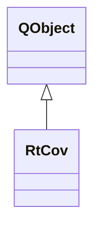

# RtCov

**Namespace:** `RTPROCESSINGLIB` &nbsp;·&nbsp; **Library:** DSP Library

`#include <dsp/rt_cov.h>`

```cpp
class RTPROCESSINGLIB::RtCov
```

Real-time covariance worker.

Controller that manages background covariance matrix estimation from streaming data.

### Inheritance



---

## Public Methods

### RtCov(pFiffInfo)

---

### estimateCovariance(matData, iNewMaxSamples)

Perform actual covariance estimation.

**Parameters:**

- **matData** : *const Eigen::MatrixXd &*
  Data to estimate the covariance from.

- **iNewMaxSamples** : *int*
  Number of samples to accumulate before a covariance is estimated.

**Returns:**

- *[FiffCov](/docs/api/fiff/fiff-cov)* — Noise covariance of the MEG/EEG channels, or an empty FiffCov while fewer than iNewMaxSamples samples are accumulated or if no FiffInfo was set.

---

## Authors of this file

- Christoph Dinh &lt;christoph.dinh@mne-cpp.org&gt;
