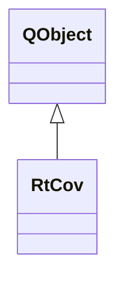

# RtCov

**Namespace:** `RTPROCESSINGLIB` &nbsp;·&nbsp; **Library:** DSP Library

`#include <dsp/rt_cov.h>`

```cpp
class RTPROCESSINGLIB::RtCov
```

Real-time covariance worker.

Controller that manages background covariance matrix estimation from streaming data.

```cpp title="src/examples/ex_dsp_rt/main.cpp"
RtCov rtCov(info);
FiffCov cov;
for (int start = 0; start < covData.cols(); start += 1000) {
    cov = rtCov.estimateCovariance(covData.middleCols(start, 1000), 4000); // empty until 4000 samples arrived
}
```

### Inheritance



---

## Public Methods

### RtCov(pFiffInfo)

---

### estimateCovariance(matData, iNewMaxSamples)

Perform actual covariance estimation.

**Parameters:**

- **matData** : *const Eigen::MatrixXd &*
  Data to estimate the covariance from.

- **iNewMaxSamples** : *int*
  Number of samples to accumulate before a covariance is estimated.

**Returns:**

- *[FiffCov](/docs/api/fiff/fiff-cov)* — Noise covariance of the MEG/EEG channels, or an empty FiffCov while fewer than iNewMaxSamples samples are accumulated or if no FiffInfo was set.

---

## Example

- Full source: [`src/examples/ex_dsp_rt/main.cpp`](https://github.com/mne-tools/mne-cpp/tree/staging/src/examples/ex_dsp_rt/main.cpp)
- Build target: `ex_dsp_rt` (runs under CTest)
- Data: [mne-cpp-test-data](https://github.com/mne-tools/mne-cpp-test-data)

## Authors of this file

- Christoph Dinh &lt;christoph.dinh@mne-cpp.org&gt;
