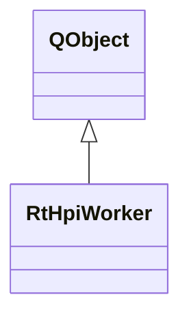

# RtHpiWorker

**Namespace:** `RTPROCESSINGLIB` &nbsp;·&nbsp; **Library:** DSP Library

`#include <dsp/rt_hpis.h>`

```cpp
class RTPROCESSINGLIB::RtHpiWorker
```

Real-time HPI worker.

Background worker thread that runs continuous HPI coil localization.

```cpp title="src/examples/ex_dsp_rt/main.cpp"
InvHpiDataUpdater updater(hpiInfo); // MEG picks, sensor geometry and digitised coil positions
updater.prepareDataAndProjectors(hpiData, projectors);
const InvHpiModelParameters model(QVector<int>({166, 154, 161, 158}), hpiInfo->sfreq, hpiInfo->linefreq, false);

RtHpiWorker hpiWorker(updater.getSensors());
HpiFitResult workerFit;
QObject::connect(&hpiWorker, &RtHpiWorker::resultReady, [&](const HpiFitResult& fit) { workerFit = fit; });
hpiWorker.doWork(updater.getProjectedData(), updater.getProjectors(), model, updater.getHpiDigitizer());
```

### Inheritance



---

## Public Methods

### RtHpiWorker(sensorSet)

Creates the real-time HPI worker object.

**Parameters:**

- **sensorSet** : *const [InvSensorSet](/docs/api/inv/inv-sensor-set)*
  Associated Fiff Information.

---

### doWork(matData, matProjectors, hpiModelParameters, matCoilsHead)

Perform one single HPI fit.

**Parameters:**

- **matData** : *const Eigen::MatrixXd &*
  Data to estimate the HPI positions from.

- **matProjectors** : *const Eigen::MatrixXd &*
  The projectors to apply. Bad channels are still included.

- **hpiModelParameters** : *const [InvHpiModelParameters](/docs/api/inv/inv-hpi-model-parameters) &*
  HPI model parameters (coil frequencies, line frequency, ...).

- **matCoilsHead** : *const Eigen::MatrixXd &*
  Digitized HPI coil positions in head space.

---

## Example

- Full source: [`src/examples/ex_dsp_rt/main.cpp`](https://github.com/mne-tools/mne-cpp/tree/staging/src/examples/ex_dsp_rt/main.cpp)
- Build target: `ex_dsp_rt` (runs under CTest)
- Data: [mne-cpp-test-data](https://github.com/mne-tools/mne-cpp-test-data)

## Authors of this file

- Christoph Dinh &lt;christoph.dinh@mne-cpp.org&gt;
