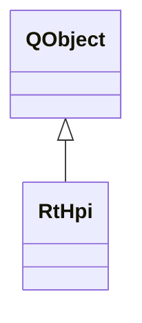

# RtHpi

**Namespace:** `RTPROCESSINGLIB` &nbsp;·&nbsp; **Library:** DSP Library

`#include <dsp/rt_hpis.h>`

```cpp
class RTPROCESSINGLIB::RtHpi
```

Real-time Head Coil Positions estimation.

Controller that manages [`RtHpiWorker`](/docs/api/dsp/rt-hpi-worker) for continuous head position tracking.

```cpp title="src/examples/ex_dsp_rt/main.cpp"
InvHpiDataUpdater updater(hpiInfo); // MEG picks, sensor geometry and digitised coil positions
updater.prepareDataAndProjectors(hpiData, projectors);
const InvHpiModelParameters model(QVector<int>({166, 154, 161, 158}), hpiInfo->sfreq, hpiInfo->linefreq, false);

RtHpiWorker hpiWorker(updater.getSensors());
HpiFitResult workerFit;
QObject::connect(&hpiWorker, &RtHpiWorker::resultReady, [&](const HpiFitResult& fit) { workerFit = fit; });
hpiWorker.doWork(updater.getProjectedData(), updater.getProjectors(), model, updater.getHpiDigitizer());
```

### Inheritance



---

## Public Methods

### RtHpi(sensorSet, parent)

Creates the real-time HPIS estimation object.

**Parameters:**

- **sensorSet** : *const [InvSensorSet](/docs/api/inv/inv-sensor-set)*
  Associated Fiff Information.

- **parent** : *QObject **
  Parent QObject (optional).

---

### ~RtHpi()

Destroys the Real-time HPI estimation object.

---

### append(data)

Slot to receive incoming data.

**Parameters:**

- **data** : *const Eigen::MatrixXd &*
  Data to estimate the HPI positions from.

---

### setModelParameters(hpiModelParameters)

Set the coil frequencies.

**Parameters:**

- **hpiModelParameters** : *[InvHpiModelParameters](/docs/api/inv/inv-hpi-model-parameters)*
  The coil frequencies.

---

### setProjectionMatrix(matProjectors)

Set the new projection matrix.

**Parameters:**

- **matProjectors** : *const Eigen::MatrixXd &*
  The new projection matrix.

---

### setHpiDigitizer(matCoilsHead)

Set the new projection matrix.

**Parameters:**

- **matCoilsHead** : *const Eigen::MatrixXd &*
  The new projection matrix.

---

### restart()

Restarts the thread by interrupting its computation queue, quitting, waiting and then starting it again.

---

### stop()

Stops the thread by interrupting its computation queue, quitting and waiting.

---

## Example

- Full source: [`src/examples/ex_dsp_rt/main.cpp`](https://github.com/mne-tools/mne-cpp/tree/staging/src/examples/ex_dsp_rt/main.cpp)
- Build target: `ex_dsp_rt` (runs under CTest)
- Data: [mne-cpp-test-data](https://github.com/mne-tools/mne-cpp-test-data)

## Authors of this file

- Christoph Dinh &lt;christoph.dinh@mne-cpp.org&gt;
