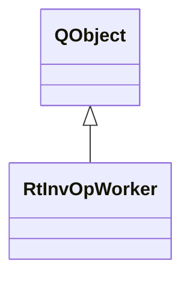

# RtInvOpWorker

**Namespace:** `RTPROCESSINGLIB` &nbsp;·&nbsp; **Library:** DSP Library

`#include <dsp/rt_inv_op.h>`

```cpp
class RTPROCESSINGLIB::RtInvOpWorker
```

Real-time inverse operator worker.

Background worker thread that recomputes the [MNE](/docs/api/mne/mne-class) inverse operator when covariance updates arrive.

```cpp title="src/examples/ex_dsp_rt/main.cpp"
RtInvOp rtInvOp(rawInfo, fwd); // MEG-only operator, loose 0.2, depth 0.8
MNEInverseOperator inverse;
bool inverseDone = false;
QObject::connect(&rtInvOp, &RtInvOp::invOperatorCalculated, [&](const MNEInverseOperator& op) {
    inverse = op;
    inverseDone = true;
});
rtInvOp.append(noiseCov); // e.g. each new RtCov estimate
```

### Inheritance



---

## Public Methods

### doWork(inputData)

Perform actual inverse operator creation.

**Parameters:**

- **inputData** : *const RtInvOpInput &*
  Data to estimate the inverse operator from.

---

## Example

- Full source: [`src/examples/ex_dsp_rt/main.cpp`](https://github.com/mne-tools/mne-cpp/tree/staging/src/examples/ex_dsp_rt/main.cpp)
- Build target: `ex_dsp_rt` (runs under CTest)
- Data: [mne-cpp-test-data](https://github.com/mne-tools/mne-cpp-test-data)

## Authors of this file

- Christoph Dinh &lt;christoph.dinh@mne-cpp.org&gt;
