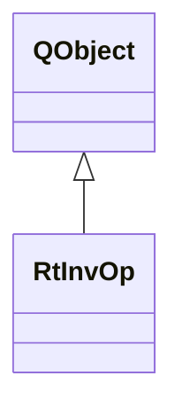

# RtInvOp

**Namespace:** `RTPROCESSINGLIB` &nbsp;·&nbsp; **Library:** DSP Library

`#include <dsp/rt_inv_op.h>`

```cpp
class RTPROCESSINGLIB::RtInvOp
```

Real-time inverse dSPM, sLoreta inverse operator estimation.

Controller that manages [`RtInvOpWorker`](/docs/api/dsp/rt-inv-op-worker) for online inverse operator updates.

### Inheritance



---

## Public Methods

### RtInvOp(p_pFiffInfo, p_pFwd, parent)

Creates the real-time inverse operator estimation object.

**Parameters:**

- **p_pFiffInfo** : *QSharedPointer&lt;[FiffInfo](/docs/api/fiff/fiff-info)&gt; &*
  Fiff measurement info.

- **p_pFwd** : *QSharedPointer&lt;[MNEForwardSolution](/docs/api/mne/mne-forward-solution)&gt; &*
  Forward solution.

- **parent** : *QObject **
  Parent QObject (optional).

---

### ~RtInvOp()

Destroys the inverse operator estimation object.

---

### append(noiseCov)

Slot to receive incoming noise covariance estimations.

**Parameters:**

- **noiseCov** : *const [FiffCov](/docs/api/fiff/fiff-cov) &*
  Noise covariance estimation.

---

### setFwdSolution(pFwd)

Slot to receive incoming forward solution.

**Parameters:**

- **pFwd** : *QSharedPointer&lt;[MNEForwardSolution](/docs/api/mne/mne-forward-solution)&gt;*
  Forward solution.

---

### restart()

Restarts the thread by interrupting its computation queue, quitting, waiting and then starting it again.

---

### stop()

Stops the thread by interrupting its computation queue, quitting and waiting.

---

## Authors of this file

- Christoph Dinh &lt;christoph.dinh@mne-cpp.org&gt;
