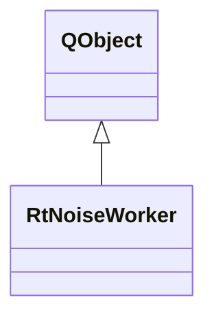

# RtNoiseWorker

**Namespace:** `RTPROCESSINGLIB` &nbsp;·&nbsp; **Library:** DSP Library

`#include <dsp/rt_noise.h>`

```cpp
class RTPROCESSINGLIB::RtNoiseWorker
```

Background worker that computes a noise power spectral density estimate from accumulated data blocks.

```cpp title="src/examples/ex_dsp_rt/main.cpp"
RtNoiseWorker noiseWorker(64, info200, 10); // 64-point FFT over 10 accumulated blocks
MatrixXd spectrum;
QObject::connect(&noiseWorker, &RtNoiseWorker::resultReady, [&](const MatrixXd& psd) { spectrum = psd; });
for (int b = 0; b < 10; ++b) {
    noiseWorker.doWork(tones.middleCols(64 * b, 64)); // dB re unit^2/Hz, channels x (fft/2 + 1)
}
```

### Inheritance



---

## Public Methods

### RtNoiseWorker(iFftLength, pFiffInfo, iDataLength)

Creates the worker.

**Parameters:**

- **iFftLength** : *qint32*
  FFT length (number of samples per window).

- **pFiffInfo** : *[FIFFLIB::FiffInfo](/docs/api/fiff/fiff-info)::SPtr*
  Associated Fiff Information.

- **iDataLength** : *qint32*
  Number of blocks to accumulate before computing the spectrum.

---

### doWork(matData)

Process one data block, accumulate, and emit the spectrum when enough blocks are collected.

**Parameters:**

- **matData** : *const Eigen::MatrixXd &*
  The incoming data block (channels x samples).

---

## Example

- Full source: [`src/examples/ex_dsp_rt/main.cpp`](https://github.com/mne-tools/mne-cpp/tree/staging/src/examples/ex_dsp_rt/main.cpp)
- Build target: `ex_dsp_rt` (runs under CTest)
- Data: [mne-cpp-test-data](https://github.com/mne-tools/mne-cpp-test-data)

## Authors of this file

- Christoph Dinh &lt;christoph.dinh@mne-cpp.org&gt;
