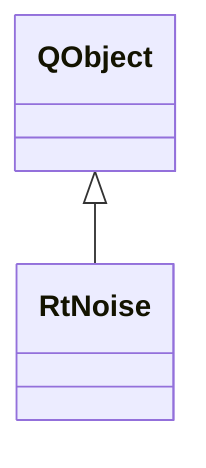

# RtNoise

**Namespace:** `RTPROCESSINGLIB` &nbsp;·&nbsp; **Library:** DSP Library

`#include <dsp/rt_noise.h>`

```cpp
class RTPROCESSINGLIB::RtNoise
```

Controller that manages [`RtNoiseWorker`](/docs/api/dsp/rt-noise-worker) for real-time noise spectrum estimation.

```cpp title="src/examples/ex_dsp_rt/main.cpp"
RtNoiseWorker noiseWorker(64, info200, 10); // 64-point FFT over 10 accumulated blocks
MatrixXd spectrum;
QObject::connect(&noiseWorker, &RtNoiseWorker::resultReady, [&](const MatrixXd& psd) { spectrum = psd; });
for (int b = 0; b < 10; ++b) {
    noiseWorker.doWork(tones.middleCols(64 * b, 64)); // dB re unit^2/Hz, channels x (fft/2 + 1)
}
```

### Inheritance



---

## Public Methods

### RtNoise(iFftLength, pFiffInfo, iDataLength, parent)

Creates the real-time noise estimation object.

**Parameters:**

- **iFftLength** : *qint32*
  Number of samples per FFT window.

- **pFiffInfo** : *[FIFFLIB::FiffInfo](/docs/api/fiff/fiff-info)::SPtr*
  Associated Fiff Information.

- **iDataLength** : *qint32*
  Number of blocks to accumulate before computing.

- **parent** : *QObject **
  Parent QObject (optional).

---

### ~RtNoise()

Destroys the real-time noise estimation object.

---

### append(matData)

Submit incoming data for noise estimation.

**Parameters:**

- **matData** : *const Eigen::MatrixXd &*
  Data block (channels x samples).

---

### isRunning()

Returns whether the worker thread is running.

**Returns:**

- *bool* — True between `start()` and `stop()`, false otherwise.

---

### start()

Starts the worker thread.

**Returns:**

- *bool* — true on success.

---

### stop()

Stops the worker thread.

**Returns:**

- *bool* — true on success.

---

### wait(time)

Blocks until the worker thread has finished, or until the timeout (ms) expires.

**Parameters:**

- **time** : *unsigned long*
  Timeout in ms; ULONG_MAX waits indefinitely.

**Returns:**

- *bool* — True if the thread finished, false if the timeout expired.

---

## Example

- Full source: [`src/examples/ex_dsp_rt/main.cpp`](https://github.com/mne-tools/mne-cpp/tree/staging/src/examples/ex_dsp_rt/main.cpp)
- Build target: `ex_dsp_rt` (runs under CTest)
- Data: [mne-cpp-test-data](https://github.com/mne-tools/mne-cpp-test-data)

## Authors of this file

- Christoph Dinh &lt;christoph.dinh@mne-cpp.org&gt;
