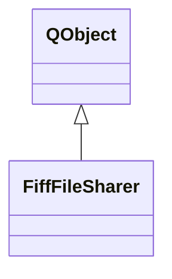

# FiffFileSharer

**Namespace:** `FIFFLIB` &nbsp;·&nbsp; **Library:** FIFF Library

`#include <fiff/fiff_file_sharer.h>`

```cpp
class FIFFLIB::FiffFileSharer
```

Copies FIFF recordings into a shared directory and signals their arrival to a watching consumer.

```cpp title="src/examples/ex_fiff_structure/main.cpp"
// Hand a finished recording to another application through a watched directory.
QDir::setCurrent(tmp.path());
FiffFileSharer consumer("shared");
QStringList arrived;
QObject::connect(&consumer, &FiffFileSharer::newFileAtPath, [&](const QString& path) { arrived << path; });
consumer.initWatcher();
FiffFileSharer producer("shared");
producer.copyRealtimeFile(rawPath); // shared/realtime_file0_raw.fif
```

### Inheritance



---

## Public Methods

### FiffFileSharer()

Constructs a [`FiffFileSharer`](/docs/api/fiff/fiff-file-sharer) with default paramaters (based on m_sDefaultDirectory and m_sDefaultFileName).

---

### FiffFileSharer(sDirName)

Constructs a [`FiffFileSharer`](/docs/api/fiff/fiff-file-sharer) to watch/save to sDirName.

**Parameters:**

- **sDirName** : *const QString &*
  Directory to/from which data will saved/read

---

### copyRealtimeFile(sSourcePath)

Copies an unfinished FIFF file into the shared directory and closes its raw block; the copy appears there only once it is complete.

**Parameters:**

- **sSourcePath** : *const QString &*
  source file to ber copied

---

### initWatcher()

Sets member QFileSystemWatcher to watch set directory.

---

## Example

- Full source: [`src/examples/ex_fiff_structure/main.cpp`](https://github.com/mne-tools/mne-cpp/tree/staging/src/examples/ex_fiff_structure/main.cpp)
- Build target: `ex_fiff_structure` (runs under CTest)
- Data: [mne-cpp-test-data](https://github.com/mne-tools/mne-cpp-test-data)

## Authors of this file

- Christoph Dinh &lt;christoph.dinh@mne-cpp.org&gt;
