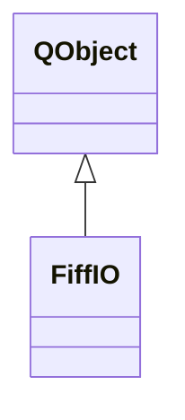

# FiffIO

**Namespace:** `FIFFLIB` &nbsp;·&nbsp; **Library:** FIFF Library

`#include <fiff/fiff_io.h>`

```cpp
class FIFFLIB::FiffIO
```

One-call FIFF reader/writer: opens a file, dispatches to the right specialized loader and returns ready-to-use `FIFFLIB` containers.

Sniffs the FIFF block tree, dispatches [`FiffRawData`](/docs/api/fiff/fiff-raw-data) / [`FiffEvokedSet`](/docs/api/fiff/fiff-evoked-set) / [`FiffCov`](/docs/api/fiff/fiff-cov) / [`FiffInfo`](/docs/api/fiff/fiff-info) loaders as appropriate, and returns shared pointers so the resulting objects can be freely passed across the rest of the pipeline. Front-end parity with `mne.io.read_raw_fif` and friends.

```cpp title="src/examples/ex_fiff_api/main.cpp"
QFile ioFile(dir + "/sample_audvis-ave.fif");
FiffIO io(ioFile); // detects what the file holds (raw, evoked, fwd, ...)
```

### Inheritance



---

## Public Methods

### FiffIO()

Constructs a [`FiffIO`](/docs/api/fiff/fiff-io).

---

### ~FiffIO()

Destroys the [`FiffIO`](/docs/api/fiff/fiff-io).

---

### FiffIO(pIODevice)

Constructs a [`FiffIO`](/docs/api/fiff/fiff-io) object by reading from a I/O device pIODevice.

**Parameters:**

- **pIODevice** : *QIODevice &*
  A fiff IO device like a fiff QFile or QTCPSocket.

---

### FiffIO(p_qlistIODevices)

Constructs a [`FiffIO`](/docs/api/fiff/fiff-io) object that uses the I/O device pIODevice.

**Parameters:**

- **p_qlistIODevices** : *QList&lt; QIODevice * &gt; &*
  A QList of fiff IO devices like a fiff QFile or QTCPSocket.

---

### FiffIO(p_FiffIO)

Copy constructor.

**Parameters:**

- **p_FiffIO** : *const FiffIO &*
  [`FiffIO`](/docs/api/fiff/fiff-io), which should be copied.

---

### read(pIODevice)

Read data from a pIODevice.

**Parameters:**

- **pIODevice** : *QIODevice &*
  A fiff IO device like a fiff QFile or QTCPSocket.

**Returns:**

- *bool* — false if the directory tree could not be read, true otherwise.

---

### read(p_qlistIODevices)

Read data from a QList of pIODevices.

**Parameters:**

- **p_qlistIODevices** : *QList&lt; QIODevice &gt; &*
  A QList of fiff IO devices like a fiff QFile or QTCPSocket.

**Returns:**

- *bool* — true if all devices were read successfully, false otherwise.

---

### write(pIODevice, type, idx)

Write data to a single pIODevice.

**Parameters:**

- **pIODevice** : *QIODevice &*
  A fiff IO device like a fiff QFile or QTCPSocket.

- **type** : *const fiff_int_t*
  Type of data to write (fiff constants types, e.g. FIFFB_RAW_DATA).

- **idx** : *const fiff_int_t*
  Index of type, -1 for all entities of this type.

**Returns:**

- *bool* — true if succeeded, false otherwise.

---

### write(p_QFile, type, idx)

Write whole data of a type to a fiff file.

**Parameters:**

- **p_QFile** : *QFile &*
  Output file (name extended with type and index, e.g. sample_audvis-type-1.fif).

- **type** : *const fiff_int_t*
  Type of data to write (fiff constants types, e.g. FIFFB_RAW_DATA).

- **idx** : *const fiff_int_t*
  Index of type, -1 for all entities of this type.

**Returns:**

- *bool* — true if succeeded, false otherwise.

---

### write_raw(pIODevice, idx)

Write raw data to a pIODevice.

**Parameters:**

- **pIODevice** : *QIODevice &*
  A fiff IO device like a fiff QFile or QTCPSocket.

- **idx** : *const fiff_int_t*
  Index of type, -1 for all entities of this type.

**Returns:**

- *bool* — true if succeeded, false otherwise.

---

## Static Methods

### setup_read(pIODevice, info, dirTree)

Setup a [`FiffStream`](/docs/api/fiff/fiff-stream).

**Parameters:**

- **pIODevice** : *QIODevice &*
  An fiff IO device like a fiff QFile or QTCPSocket.

- **info** : *[FiffInfo](/docs/api/fiff/fiff-info) &*
  Overall info for fiff IO device.

- **dirTree** : *[FiffDirNode](/docs/api/fiff/fiff-dir-node)::SPtr &*
  Node directory structure.

**Returns:**

- *bool* — true if succeeded, false otherwise.

---

## Example

- Full source: [`src/examples/ex_fiff_api/main.cpp`](https://github.com/mne-tools/mne-cpp/tree/staging/src/examples/ex_fiff_api/main.cpp)
- Build target: `ex_fiff_api` (runs under CTest)
- Data: [mne-cpp-test-data](https://github.com/mne-tools/mne-cpp-test-data)

## Authors of this file

- Florian Schlembach &lt;fschlembach@web.de&gt;
- Christoph Dinh &lt;christoph.dinh@mne-cpp.org&gt;
- Lorenz Esch &lt;lorenz.esch@tu-ilmenau.de&gt;
- Juan GPC &lt;jgarciaprieto@mgh.harvard.edu&gt;
- Gabriel Motta &lt;gabrielbenmotta@gmail.com&gt;
