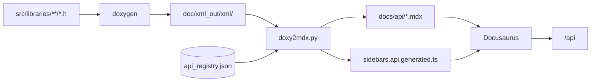

{/* SPDX-License-Identifier: BSD-3-Clause */}
{/* Copyright (c) 2026 MNE-CPP Authors */}
{/*   Christoph Dinh <christoph.dinh@mne-cpp.org> */}

# MNE-CPP API Reference

This section is the canonical reference for every public class in the
MNE-CPP C++ libraries. It is generated automatically from the in-source
Doxygen comments and a curated registry of public symbols, so the view
you see here always matches the headers that ship with the build.

The registry lives at
[`doc/api_registry.json`](https://github.com/mne-tools/mne-cpp/blob/staging/doc/api_registry.json)
and the generator is implemented in
[`tools/doxy2mdx/doxy2mdx.py`](https://github.com/mne-tools/mne-cpp/blob/staging/tools/doxy2mdx/doxy2mdx.py).

## How to use this reference

- Pick a **library** from the sidebar on the left. Each entry expands
  into the public classes and header-level modules it ships. The
  sidebar labels are human-readable ("FIFF Library", "MNE Library",
  "Forward Library", …); the C++ namespace they map to is listed in
  the table below.
- **Class pages** start with a banner that names the C++ **namespace**,
  the **library** the class belongs to, and the **header** it ships
  in. Below that the page lists the public **Signals**, **Public
  Slots**, **Public Methods** and **Static Methods** with full
  Doxygen-derived signatures, parameter descriptions and
  KaTeX-rendered math. The right-hand table of contents lets you jump
  between members.
- **Module pages** document headers that contain free functions
  instead of a C++ class (for example `Sphara`, `PeakFinder`,
  `InvConvenience`).
- Pages that have a worked example in
  [`src/examples/`](https://github.com/mne-tools/mne-cpp/tree/staging/src/examples)
  surface it inline in a dedicated **Example** section so you have a
  runnable starting point.

## Libraries and namespaces

MNE-CPP provides a modular set of cross-platform C++ libraries built on
[Qt](https://www.qt.io/) and [Eigen](http://eigen.tuxfamily.org/). All
MNE-CPP applications — MNE Scan, MNE Analyze, MNE Anonymize, and the
command-line tools — are built solely on these libraries, so any
functionality available in an application can also be used
programmatically. The libraries are organised in layers: low-level I/O
and math utilities at the bottom, domain-specific processing in the
middle, and visualization at the top.

### Core Libraries

| Library | Namespace | Purpose |
|---------|-----------|---------|
| [**Utils**](/docs/api/utils/) | `UTILSLIB` | Shared utilities: I/O helpers, spectral analysis, layout management, and warp algorithms |
| [**Math**](/docs/api/math/) | `MATHLIB` | Mathematical algorithms and geometry: linear algebra, optimization, spectral estimation, K-Means, sphere fitting |
| [**Fs**](/docs/api/fs/) | `FSLIB` | FreeSurfer surface and annotation I/O |
| [**Fiff**](/docs/api/fiff/) | `FIFFLIB` | FIFF file I/O and data structures (raw, epochs, evoked, covariance, forward) |
| [**Mne**](/docs/api/mne/) | `MNELIB` | Core MNE data structures: source spaces, source estimates, hemispheres |
| [**Mri**](/docs/api/mri/) | `MRILIB` | MRI volume and coordinate-system I/O (volumes, voxel geometry, transforms) |
| [**Bids**](/docs/api/bids/) | `BIDSLIB` | BIDS dataset reading, writing, path construction, and sidecar metadata handling for iEEG/EEG/MEG |

### Processing Libraries

| Library | Namespace | Purpose |
|---------|-----------|---------|
| [**Fwd**](/docs/api/fwd/) | `FWDLIB` | Forward modelling: BEM and MEG/EEG lead field computation |
| [**Inv**](/docs/api/inv/) | `INVLIB` | Inverse source estimation: MNE, dSPM, sLORETA, beamforming, dipole fitting, HPI fitting, RAP-MUSIC |
| [**Dsp**](/docs/api/dsp/) | `DSPLIB` | Digital signal processing: filtering, spectrograms, real-time averaging, trigger detection, SPHARA, HPI, noise reduction |
| [**Conn**](/docs/api/conn/) | `CONNLIB` | Functional connectivity metrics: Coherence, Cross-Correlation, PLV, PLI, WPLI, and variants |
| [**Lsl**](/docs/api/lsl/) | `LSLLIB` | Lab Streaming Layer (LSL) integration for real-time data exchange |
| [**Mna**](/docs/api/mna/) | `MNALIB` | MNA graph engine: analysis pipeline specification (`.mna`/`.mnx`), operator schemas, batch and stream execution |
| [**Ml**](/docs/api/ml/) | `MLLIB` | Machine learning: ONNX Runtime inference, linear models, feature pipelines, scalers, tensors |
| [**Sts**](/docs/api/sts/) | `STSLIB` | Statistics: t-tests, F-tests, cluster permutation, covariance estimators (Ledoit-Wolf, shrinkage), source-level metrics |

### Visualization Libraries

| Library | Namespace | Purpose |
|---------|-----------|---------|
| [**Disp**](/docs/api/disp/) | `DISPLIB` | 2D display widgets and visualization helpers: charts, topography, colour maps, `QWidget`-based viewers |
| [**Disp3D**](/docs/api/disp3-d/) | `DISP3DLIB` | 3D brain visualization using the Qt RHI rendering backend: cortical surfaces, connectivity networks, BEM models, source estimates, digitizers — supports Metal, Vulkan, D3D, and OpenGL backends |

Each library link above leads to its dedicated overview page with the
architecture diagram, class inventory, MNE-Python and MNE-C
cross-references, code examples, and gap analysis.

## External API references

The legacy auto-generated Doxygen HTML reference is still available
alongside this site. Use these entry points to navigate it:

| Section | Description |
|---|---|
| [Doxygen API Reference](https://mne-cpp.github.io/doxygen-api/) | Full auto-generated Doxygen HTML site |
| [Namespace List](https://mne-cpp.github.io/doxygen-api/namespaces.html) | All namespaces with brief descriptions — one per library |
| [Class List](https://mne-cpp.github.io/doxygen-api/annotated.html) | Alphabetical list of all classes, structs, and unions |
| [Class Hierarchy](https://mne-cpp.github.io/doxygen-api/hierarchy.html) | Inheritance tree showing parent-child relationships |
| [Class Members](https://mne-cpp.github.io/doxygen-api/functions.html) | Index of all documented class members |
| [Namespace Members](https://mne-cpp.github.io/doxygen-api/namespacemembers.html) | All symbols declared at namespace scope |
| [File List](https://mne-cpp.github.io/doxygen-api/files.html) | Source and header files with directory structure |

## Generation pipeline



Reproduce locally with
[`doc/build-api-docs.sh`](https://github.com/mne-tools/mne-cpp/blob/staging/doc/build-api-docs.sh).
The generator refuses to write a sidebar when a registered
`documented: true` entry has no corresponding Doxygen XML, so the public
surface and the docs stay in lock-step.

## Adding a new public class

1. Add an entry to `doc/api_registry.json` under `classes`:

   ```json
   {
     "name": "MyClass",
     "module": "fiff",
     "header": "fiff/my_class.h",
     "origin": "custom",
     "documented": true,
     "sidebar_position": 50,
     "example": "ex_my_class"
   }
   ```

2. Make sure the header has Doxygen `/** ... */` blocks for the class
   and every public member you want to surface.
3. (Optional) Add a worked example under `src/examples/ex_my_class/`
   and reference its directory name from the `example` field. The
   first contiguous block of code from `main.cpp` is embedded into the
   generated class page.
4. Run `doc/build-api-docs.sh` and verify your class appears at
   `/api/<module>/<my-class>`.
