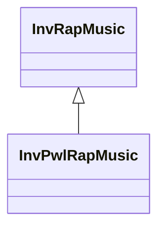

# InvRapMusic

**Namespace:** `INVERSELIB` &nbsp;·&nbsp; **Library:** Inverse Library

:::info[Python equivalent]
`mne.beamformer.rap_music` in MNE-Python.
:::

`#include <inv/inv_rap_music.h>`

```cpp
class INVLIB::InvRapMusic
```

RAP MUSIC (Recursively Applied and Projected Multiple Signal Classification) source localization algorithm.

Implements the RAP MUSIC scanning algorithm which iteratively identifies correlated source pairs by projecting the signal subspace and re-scanning the lead field. Each iteration finds one dipole (or dipole pair), projects it out of the signal subspace, and repeats until the desired number of sources is found or the residual correlation drops below threshold.

Reference: Mosher & Leahy, IEEE Trans. Signal Process. 47(2), 332-340, 1999.

### Inheritance



---

## Public Methods

### InvRapMusic()

Default constructor creates an empty [`InvRapMusic`](/docs/api/inv/inv-rap-music) algorithm which still needs to be initialized.

---

### InvRapMusic(p_pFwd, p_bSparsed, p_iN, p_dThr)

Constructor which initializes the [`InvRapMusic`](/docs/api/inv/inv-rap-music) algorithm with the given model.

**Parameters:**

- **p_Fwd**
  The model which contains the gain matrix and its corresponding grid matrix.

- **p_bSparsed** : *bool*
  True when sparse matrices should be used.

- **p_iN** : *int*
  The number (default 2) of uncorrelated sources, which should be found. Starting with. the strongest.

- **p_dThr** : *double*
  The correlation threshold (default 0.5) at which the search for sources stops.

---

### ~InvRapMusic()

---

### init(p_pFwd, p_bSparsed, p_iN, p_dThr)

Initializes the RAP MUSIC algorithm with the given model.

**Parameters:**

- **p_Fwd**
  The model which contains the gain matrix and its corresponding Grid matrix.

- **p_bSparsed** : *bool*
  True when sparse matrices should be used.

- **p_iN** : *int*
  The number (default 2) of uncorrelated sources, which should be found. Starting with. the strongest.

- **p_dThr** : *double*
  The correlation threshold (default 0.5) at which the search for sources stops.

**Returns:**

- *bool* — true if successful initialized, false otherwise.

---

### calculateInverse(p_fiffEvoked, pick_normal)

---

### calculateInverse(data, tmin, tstep, pick_normal)

---

### calculateInverse(p_matMeasurement, p_RapDipoles)

---

### getName()

---

### getSourceSpace()

---

### setStcAttr(p_iSampStcWin, p_fStcOverlap)

Sets the source estimate attributes.

**Parameters:**

- **p_iSampStcWin** : *int*
  Samples per source localization window (default - 1 = not set).

- **p_fStcOverlap** : *float*
  Percentage of localization window overlap.

---

## Example

- Full source: [`src/examples/ex_inverse_rap_music/main.cpp`](https://github.com/mne-tools/mne-cpp/tree/staging/src/examples/ex_inverse_rap_music/main.cpp)
- Build target: `ex_inverse_rap_music` (compiled in CI)

## Authors of this file

- Christoph Dinh &lt;christoph.dinh@mne-cpp.org&gt;
