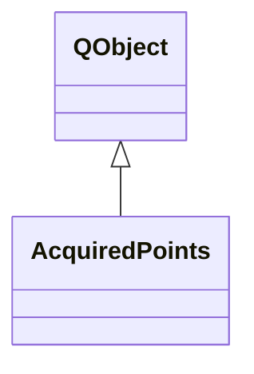

# AcquiredPoints

**Namespace:** `UTILSLIB` &nbsp;·&nbsp; **Library:** Utilities Library

`#include <utils/acquired_points.h>`

```cpp
class UTILSLIB::AcquiredPoints
```

In-memory store of all points captured during a session.

The wizard hands one of these to the 3-D view (for visualisation) and later to the export step (for FIFF write). Single-threaded, no locking.

```cpp title="src/examples/ex_utils/main.cpp"
AcquiredPoints points;
points.append({PointKind::HeadShape, "HSP-1", 1, QVector3D(0.0f, 0.08f, 0.05f)});
points.append({PointKind::Eeg, "Cz", 1, QVector3D(0.0f, 0.0f, 0.09f)});
points.undoLast(PointKind::HeadShape);
const DigitizedPoint& kept = points.points().first(); // kind, label, FIFF ident, position (m)
```

### Inheritance



---

## Public Methods

### AcquiredPoints(parent)

---

### points()

---

### append(p)

Append a new point and emit `UTILSLIB::AcquiredPoints::pointsChanged` "pointsChanged".

**Parameters:**

- **p** : *const [DigitizedPoint](/docs/api/utils/digitized-point) &*
  Captured point to append.

---

### undoLast(kind)

Remove the most recently captured point matching `kind`, if any.

**Parameters:**

- **kind** : *PointKind*
  Point kind whose most recent entry is removed.

---

### clear()

Drop every captured point.

---

### fiducial(id)

Convenience accessor: returns the captured fiducial position for `id`, or a default-constructed `QVector3D` if not yet captured.

**Parameters:**

- **id** : *FiducialId*
  Fiducial to look up.

**Returns:**

- *QVector3D* — Captured fiducial position, or a zero vector if not yet captured.

---

### hasFiducial(id)

True iff a fiducial of the given id has been captured.

**Parameters:**

- **id** : *FiducialId*
  Fiducial to check.

**Returns:**

- *bool* — True if the fiducial has been captured, false otherwise.

---

### removeFiducial(id)

Remove a previously captured fiducial so it can be re-recorded.

**Parameters:**

- **id** : *FiducialId*
  Fiducial whose captured points are all removed.

---

### hasAllFiducials()

True iff all three cardinal fiducials have been captured.

**Returns:**

- *bool* — True if NAS, LPA, and RPA have all been captured.

---

### countOf(kind)

---

### setPosition(index, pos)

---

### emitChanged()

---

### setTwinFiducial(id, pos)

---

### clearTwinFiducial(id)

---

### hasTwinFiducial(id)

---

### twinFiducial(id)

---

### hasAllTwinFiducials()

---

## Example

- Full source: [`src/examples/ex_utils/main.cpp`](https://github.com/mne-tools/mne-cpp/tree/staging/src/examples/ex_utils/main.cpp)
- Build target: `ex_utils` (runs under CTest)

## Authors of this file

- Christoph Dinh &lt;christoph.dinh@mne-cpp.org&gt;
