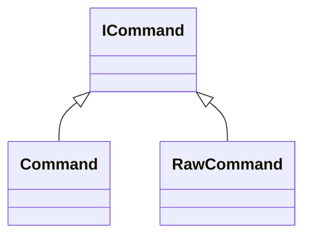

# ICommand

**Namespace:** `UTILSLIB` &nbsp;·&nbsp; **Library:** Utilities Library

`#include <utils/commandpattern.h>`

```cpp
class UTILSLIB::ICommand
```

Declare interface command.

The [`ICommand`](/docs/api/utils/i-command) interface provides the base class of every command of the command design pattern.

### Inheritance



---

## Public Methods

### ~ICommand()

Destroys the [`ICommand`](/docs/api/utils/i-command).

---

### execute()

Executes the [`ICommand`](/docs/api/utils/i-command).

---

## Authors of this file

- Christoph Dinh &lt;christoph.dinh@mne-cpp.org&gt;
- Lorenz Esch &lt;lorenz.esch@tu-ilmenau.de&gt;
- Gabriel Motta &lt;gabrielbenmotta@gmail.com&gt;
