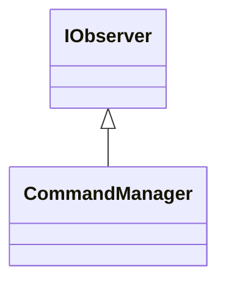

# IObserver

**Namespace:** `UTILSLIB` &nbsp;·&nbsp; **Library:** Utilities Library

`#include <utils/observerpattern.h>`

```cpp
class UTILSLIB::IObserver
```

DECLARE INTERFACE OBSERVER.

The [`IObserver`](/docs/api/utils/i-observer) interface provides the base class of every observer of the observer design pattern.

### Inheritance



---

## Public Methods

### ~IObserver()

Destroys the [`IObserver`](/docs/api/utils/i-observer).

---

### update(pSubject)

Updates the [`IObserver`](/docs/api/utils/i-observer).

**Parameters:**

- **pSubject** : *[Subject](/docs/api/utils/subject) **
  pointer to the subject where observer is attached to.

---

## Authors of this file

- Christoph Dinh &lt;christoph.dinh@mne-cpp.org&gt;
- Lorenz Esch &lt;lorenz.esch@tu-ilmenau.de&gt;
- Juan GPC &lt;jgarciaprieto@mgh.harvard.edu&gt;
- Gabriel Motta &lt;gabrielbenmotta@gmail.com&gt;
