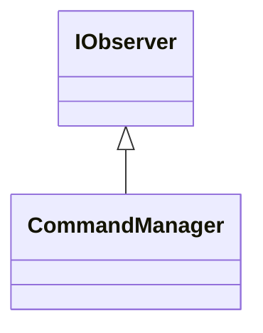

# IObserver

**Namespace:** `UTILSLIB` &nbsp;·&nbsp; **Library:** Utilities Library

`#include <utils/observerpattern.h>`

```cpp
class UTILSLIB::IObserver
```

DECLARE INTERFACE OBSERVER.

The [`IObserver`](/docs/api/utils/i-observer) interface provides the base class of every observer of the observer design pattern.

```cpp title="src/examples/ex_utils/main.cpp"
// A subject notifies every attached observer; observers pull the state they need
class Counter : public Subject
{
public:
    void increment()
    {
        ++m_value;
        notify();
    }
    int value() const
    {
        return m_value;
    }

private:
    int m_value = 0;
};

class LastSeen : public IObserver
{
public:
    void update(Subject* pSubject) override
    {
        m_seen = static_cast<Counter*>(pSubject)->value();
    }
    int seen() const
    {
        return m_seen;
    }

private:
    int m_seen = -1;
};
```

### Inheritance


```mermaid
classDiagram
    IObserver <|-- CommandManager
```

---

## Public Methods

### ~IObserver()

Destroys the [`IObserver`](/docs/api/utils/i-observer).

---

### update(pSubject)

Updates the [`IObserver`](/docs/api/utils/i-observer).

**Parameters:**

- **pSubject** : *[Subject](/docs/api/utils/subject) **
  pointer to the subject where observer is attached to.

---

## Example

- Full source: [`src/examples/ex_utils/main.cpp`](https://github.com/mne-tools/mne-cpp/tree/staging/src/examples/ex_utils/main.cpp)
- Build target: `ex_utils` (runs under CTest)

## Authors of this file

- Christoph Dinh &lt;christoph.dinh@mne-cpp.org&gt;
- Lorenz Esch &lt;lorenz.esch@tu-ilmenau.de&gt;
- Juan GPC &lt;jgarciaprieto@mgh.harvard.edu&gt;
- Gabriel Motta &lt;gabrielbenmotta@gmail.com&gt;
