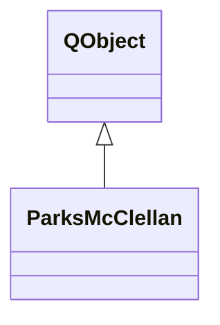

# ParksMcClellan

**Namespace:** `UTILSLIB` &nbsp;·&nbsp; **Library:** Utilities Library

`#include <utils/parksmcclellan.h>`

```cpp
class UTILSLIB::ParksMcClellan
```

DECLARE CLASS [`ParksMcClellan`](/docs/api/utils/parks-mc-clellan).

Parks-McClellan equiripple FIR filter design algorithm (Remez exchange).

```cpp title="src/examples/ex_dsp_filter/main.cpp"
// Equiripple 65-tap low-pass, corner 0.08 pi (40 Hz at 1 kHz), transition 0.04 pi
ParksMcClellan parksMcClellan(65, 0.08, 0.0, 0.04, ParksMcClellan::LPF);
```

### Inheritance



---

## Public Methods

### ParksMcClellan()

---

### ParksMcClellan(NumTaps, OmegaC, BW, ParksWidth, PassType)

NumTaps must be odd for high pass and notch filters.

Max number of taps is 128. The arrays can handle up to 256 taps, but 128 is a good practical limit for convergence. The minimum number of taps is 9 (maybe &lt; 9, I forget the exact lower limit or what sets it) OmegaC is the 3 dB corner freq for low pass and high pass filters. It is the center freq for band pass and notch filters. BW is the bandwidth for bandpass and notch filters (ignored on low and high pass). OmegaC and BW are in terms of Pi. e.g. OmegaC = 0.5 centers a BPF at Omega = Pi/2. The PM algorithm however uses frequencies in terms of 2Pi, so we need to to this: Edge[j] /= 2.0 ParksWidth is the width of the transition bands. For simplicity, we only use one width, but the algorithm allows for unique values on every band edge. Practical limits for ParksWidth are 0.02 - 0.15 for BPF and Notch, 0.02 - 0.30 for LPF and HPF. TPassType is defined in the header file. LPF = Low Pass Filter, etc. You should note our 0.01 minimum width for each band. This limit works well for the algorithm. You will also find that OmegaC and BW need to be scaled a bit, depending ParksWidth, to get the 3 dB corner frequencies to come in on target.

e.g. NewParksMcClellan(33, 0.7, 0.2, 0.1, HPF); gives a 33 tap high pass filter with 3 dB corner at 0.7 with a transition bandwidth of 0.1 The FIR coefficients are placed in FirCoeff, starting at index 0.

**Parameters:**

- **NumTaps** : *int*
  Number of filter taps (9 to 128; odd for HPF and NOTCH).

- **OmegaC** : *double*
  Corner (LPF/HPF) or center (BPF/NOTCH) frequency, normalized to Pi.

- **BW** : *double*
  Bandwidth for BPF and NOTCH, normalized to Pi; ignored for LPF/HPF.

- **ParksWidth** : *double*
  Width of the transition bands, normalized to Pi.

- **PassType** : *TPassType*
  Filter type (LPF, HPF, BPF or NOTCH).

---

### ~ParksMcClellan()

---

### init(NumTaps, OmegaC, BW, ParksWidth, PassType)

Using nothrow prevents an exception from being thrown.

new will instead return NULL. These array are much larger than actually needed. See the notes in the orig fortran file.

**Parameters:**

- **NumTaps** : *int*
  Number of filter taps (9 to 128; odd for HPF and NOTCH).

- **OmegaC** : *double*
  Corner (LPF/HPF) or center (BPF/NOTCH) frequency, normalized to Pi.

- **BW** : *double*
  Bandwidth for BPF and NOTCH, normalized to Pi; ignored for LPF/HPF.

- **ParksWidth** : *double*
  Width of the transition bands, normalized to Pi.

- **PassType** : *TPassType*
  Filter type (LPF, HPF, BPF or NOTCH).

---

### CalcParkCoeff2(NBANDS, NFILT)

---

### LeGrangeInterp2(K, N, M)

Function to calculate the lagrange interpolation coefficients for use in the function gee.

**Parameters:**

- **K** : *int*
  Index of the extremal point whose coefficient is computed.

- **N** : *int*
  Number of extremal points.

- **M** : *int*
  Stride used to interleave the product for numerical stability.

**Returns:**

- *double* — Barycentric Lagrange coefficient for point K (denominator clamped away from zero).

---

### GEE2(K, N)

Function to evaluate the frequency response using the Lagrange interpolation formula in the barycentric form.

**Parameters:**

- **K** : *int*
  Index into the dense frequency grid at which to evaluate.

- **N** : *int*
  Number of extremal points used in the interpolation.

**Returns:**

- *double* — Interpolated frequency response at grid point K.

---

### Remez2(GridIndex)

---

### ErrTest(k, Nut, Comp, Err)

This was added by IowaHills and is used in Remez() in 6 places.

**Parameters:**

- **k** : *int*
  Index into the dense frequency grid.

- **Nut** : *int*
  Sign (+1 or -1) of the expected error extremum.

- **Comp** : *double*
  Current comparison error magnitude.

- **Err** : *double **
  Weighted approximation error at grid point k.

**Returns:**

- *bool* — True if Nut times the error does not exceed Comp, false otherwise.

---

### CalcCoefficients()

This was added by IowaHills and is called from CalcParkCoeff2().

Calculation of the coefficients of the best approximation using the inverse discrete fourier transform.

---

## Example

- Full source: [`src/examples/ex_dsp_filter/main.cpp`](https://github.com/mne-tools/mne-cpp/tree/staging/src/examples/ex_dsp_filter/main.cpp)
- Build target: `ex_dsp_filter` (runs under CTest)

## Authors of this file

- Christoph Dinh &lt;christoph.dinh@mne-cpp.org&gt;
