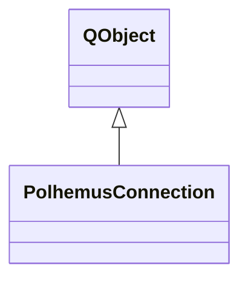

# PolhemusConnection

**Namespace:** `UTILSLIB` &nbsp;·&nbsp; **Library:** Utilities Library

`#include <utils/polhemus_connection.h>`

```cpp
class UTILSLIB::PolhemusConnection
```

Polhemus digitizer connection (mock + serial-port backends).

```cpp title="src/examples/ex_utils/main.cpp"
PolhemusConnection connection;
connection.open(QString()); // empty port name = mock backend sweeping a 10 cm sphere; e.g. "/dev/tty.usbserial" for a Fastrak
PolhemusCoregistration coreg;
coreg.setConnection(&connection); // station 1 = pen, station 2 = head tracker

// Model fiducials are the pen fiducials turned 90 deg about z and moved 5 cm in x; the registration must find that transform
QMatrix4x4 truth;
truth.translate(0.05f, 0.0f, 0.0f);
truth.rotate(90.0f, 0.0f, 0.0f, 1.0f);
const QList<FiducialId> fiducials = {FiducialId::NAS, FiducialId::LPA, FiducialId::RPA};
QList<QVector3D> penAt;
for (const FiducialId id : fiducials) {
    QEventLoop wait; // let the next mock pen sample arrive, as the user would move the pen
    QTimer::singleShot(350, &wait, &QEventLoop::quit);
    wait.exec();
    coreg.captureCurrentPenPositionAsFiducial(id);
    penAt.append(coreg.penPosition());
    coreg.setModelFiducial(id, truth.map(coreg.penPosition()));
}
const bool registered = coreg.computeRegistration();
connection.close();
```

### Inheritance



---

## Public Methods

### PolhemusConnection(parent)

---

### ~PolhemusConnection()

---

### open(portName, cfg)

Open the connection.

**Parameters:**

- **portName** : *const QString &*
  Empty → mock backend. Non-empty → hardware backend.

- **cfg** : *const PolhemusSerialConfig &*
  Serial transport configuration; ignored by the mock backend.

**Returns:**

- *bool* — True if connected (or already connected), false if the backend failed to open.

---

### close()

Close the active connection.

Safe to call when already closed.

---

### isConnected()

---

### backendName()

---

## Static Methods

### availablePorts()

Enumerate every serial port currently visible to the OS.

Convenience wrapper around `QSerialPortInfo::availablePorts` that returns just the system port names (e.g. `/dev/cu.usbserial-AB0`, `COM3`) so callers can populate a combo box without pulling in `QSerialPortInfo` themselves.

**Returns:**

- *QStringList* — System port names of all visible serial ports; empty if none.

---

### autoDetectPortName()

Best-effort auto-detection of an attached Fastrak/FastSCAN.

Polhemus Fastrak/FastSCAN units ship with an FTDI USB-serial bridge (vendor id 0x0F44 for newer Polhemus-branded units, 0x0403 for the generic FTDI chip used in older units). This scan returns the first matching port name, or an empty string if no candidate is found.

**Returns:**

- *QString* — Port name of a Polhemus-vendor port, else the first FTDI port, else an empty string.

---

## Example

- Full source: [`src/examples/ex_utils/main.cpp`](https://github.com/mne-tools/mne-cpp/tree/staging/src/examples/ex_utils/main.cpp)
- Build target: `ex_utils` (runs under CTest)

## Authors of this file

- Christoph Dinh &lt;christoph.dinh@mne-cpp.org&gt;
