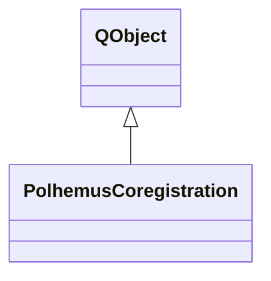

# PolhemusCoregistration

**Namespace:** `UTILSLIB` &nbsp;·&nbsp; **Library:** Utilities Library

`#include <utils/polhemus_coregistration.h>`

```cpp
class UTILSLIB::PolhemusCoregistration
```

Head–device coregistration engine driven by a Polhemus Fastrak.

The class wires itself to a [`PolhemusConnection`](/docs/api/utils/polhemus-connection) and maintains:
A continuously updated device-to-world transform (from the tracker station + user-supplied calibration offset).


An [`AcquiredPoints`](/docs/api/utils/acquired-points) store filled by explicit capture calls or automatically on pen-button press.


The computed head–device transform after `computeRegistration`.

```cpp title="src/examples/ex_utils/main.cpp"
PolhemusConnection connection;
connection.open(QString()); // empty port name = mock backend sweeping a 10 cm sphere; e.g. "/dev/tty.usbserial" for a Fastrak
PolhemusCoregistration coreg;
coreg.setConnection(&connection); // station 1 = pen, station 2 = head tracker

// Model fiducials are the pen fiducials turned 90 deg about z and moved 5 cm in x; the registration must find that transform
QMatrix4x4 truth;
truth.translate(0.05f, 0.0f, 0.0f);
truth.rotate(90.0f, 0.0f, 0.0f, 1.0f);
const QList<FiducialId> fiducials = {FiducialId::NAS, FiducialId::LPA, FiducialId::RPA};
QList<QVector3D> penAt;
for (const FiducialId id : fiducials) {
    QEventLoop wait; // let the next mock pen sample arrive, as the user would move the pen
    QTimer::singleShot(350, &wait, &QEventLoop::quit);
    wait.exec();
    coreg.captureCurrentPenPositionAsFiducial(id);
    penAt.append(coreg.penPosition());
    coreg.setModelFiducial(id, truth.map(coreg.penPosition()));
}
const bool registered = coreg.computeRegistration();
connection.close();
```

### Inheritance



---

## Public Methods

### PolhemusCoregistration(parent)

---

### ~PolhemusCoregistration()

---

### setTrackerStation(station)

---

### setPenStation(station)

---

### setProbeStation(station)

---

### trackerStation()

---

### penStation()

---

### probeStation()

---

### setPenTipOffset(offset)

---

### penTipOffset()

---

### setTipOffsetEnabled(on)

---

### tipOffsetEnabled()

---

### setAxisMirror(mirrorX, mirrorY)

Negate X and/or Y of incoming Polhemus positions.

The Polhemus Fastrak coordinate system depends on the physical placement and orientation of the transmitter. When the transmitter is oriented such that its axes are mirrored relative to the expected neuroscience convention, enable the corresponding mirror flags here.

**Parameters:**

- **mirrorX** : *bool*
  True to negate the X coordinate of incoming positions.

- **mirrorY** : *bool*
  True to negate the Y coordinate of incoming positions.

---

### mirrorX()

---

### mirrorY()

---

### startPivotCalibration()

---

### cancelPivotCalibration()

---

### pivotState()

---

### pivotSampleCount()

---

### pivotResidualMm()

---

### setTrackerToDeviceOffset(translation, rotation)

Set the rigid offset from the tracker sensor body frame to the device frame.

**Parameters:**

- **translation** : *const QVector3D &*
  Translation in metres, expressed in the tracker body frame.

- **rotation** : *const QQuaternion &*
  Rotation from tracker body frame to device frame.

---

### trackerToDeviceTranslation()

---

### trackerToDeviceRotation()

---

### captureOpticalCalibSample()

Record one calibration sample (current tracker pose + current pen position).

**Returns:**

- *bool* — `true` if both pen and tracker data are available, `false` otherwise.

---

### opticalCalibSampleCount()

**Returns:**

- *int* — Number of calibration samples recorded so far.

---

### clearOpticalCalibSamples()

Discard all calibration samples and reset the optical calibration.

---

### captureObjectiveCenter()

Capture the current pen position as the objective lens center.

Touch the pen stylus to the center of the OPMI objective lens while the tracker is live. The point is stored in the tracker's local frame and used by the solver as a direct measurement of the optical center, replacing the sphere-distance constraint.

**Returns:**

- *bool* — `true` on success, `false` if pen or tracker data unavailable.

---

### hasObjectiveCenter()

**Returns:**

- *bool* — Whether an objective center has been captured.

---

### clearObjectiveCenter()

Clear the captured objective center.

---

### objectiveCenterLocal()

Captured objective center in tracker body frame (metres).

**Returns:**

- *QVector3D* — Objective center in the tracker body frame in metres; only meaningful if `hasObjectiveCenter()` is true.

---

### solveOpticalCalibration()

Fit a 3D line through the focus points in tracker-local frame.

Requires at least 2 samples. Computes the optical axis direction and the optical center offset in the tracker body frame.

**Returns:**

- *bool* — `true` on success; `false` if insufficient or degenerate data.

---

### setKnownTrackerToObjectiveDistance(metres)

Set the known perpendicular distance from tracker sensor to the objective center (metres).

When nonzero, the solver constrains the optical center to lie at this distance from the tracker origin, vastly improving accuracy. Default: 0.200 m (~200 mm for ZEISS Kinevo). Set to 0 to disable.

**Parameters:**

- **metres** : *float*
  Tracker-to-objective distance in metres; 0 disables the constraint.

---

### knownTrackerToObjectiveDistance()

---

### opticalCalibrationValid()

**Returns:**

- *bool* — Whether a valid optical calibration has been computed.

---

### opticalAxisLocal()

Direction of the optical axis in the tracker body frame (unit vector).

**Returns:**

- *QVector3D* — Unit optical-axis direction in the tracker body frame; only meaningful if `opticalCalibrationValid()` is true.

---

### opticalCenterLocal()

Position of the optical center in the tracker body frame (metres).

**Returns:**

- *QVector3D* — Optical center in the tracker body frame in metres.

---

### opticalCalibResidualMm()

RMS residual of the last optical calibration (mm).

**Returns:**

- *float* — RMS distance of the focus points from the fitted optical axis in millimetres.

---

### opticalCalibDepthSpreadMm()

Depth spread of calibration samples along the optical axis (mm).

**Returns:**

- *float* — Extent of the calibration focus points along the optical axis in millimetres.

---

### applyOpticalAxisFineAdjust(targetWorldPos, correctionDeg)

Fine-adjust the optical axis so it passes through a known world-frame point (e.g.

the probe tip touched with the stylus).

The correction rotates `m_opticalAxisLocal` in the tracker body frame so that a ray from the optical center would pass through *targetWorldPos* at the current tracker pose.

**Parameters:**

- **targetWorldPos** : *const QVector3D &*
  Desired focus point in Polhemus world frame.

- **correctionDeg** : *float &*
  Angle of the applied correction (degrees).

**Returns:**

- *bool* — `true` on success; `false` if calibration or tracker data is unavailable, or the correction would exceed 10°.

---

### opticalFineAdjustApplied()

**Returns:**

- *bool* — Whether a fine adjustment has been applied.

---

### opticalFineAdjustDeg()

**Returns:**

- *float* — The angle of the last fine adjustment (degrees).

---

### clearOpticalFineAdjust()

Undo the last fine adjustment, restoring the original solved axis.

---

### opticalRayInWorld(origin, direction)

Compute the current optical axis ray in Polhemus world frame.

**Parameters:**

- **origin** : *QVector3D &*
  Ray origin (optical center in world frame).

- **direction** : *QVector3D &*
  Ray direction (optical axis in world frame, unit vector).

**Returns:**

- *bool* — `true` if tracker data and calibration are available.

---

### opticalUpInWorld(up)

Returns the "up" direction of the optical path in world coordinates.

This is the tracker's local Y axis rotated into the world frame, orthogonalised against the optical axis so it can be used directly as an orientation hint for projected overlays.

**Parameters:**

- **up** : *QVector3D &*
  Unit vector pointing "up" in the microscope view.

**Returns:**

- *bool* — `true` if tracker data and calibration are available.

---

### setConnection(conn)

---

### connection()

---

### acquiredPoints()

---

### captureCurrentPenPositionAsFiducial(id)

---

### captureCurrentPenPositionAsHeadShape()

---

### setModelFiducial(id, posInModel)

---

### hasModelFiducial(id)

---

### hasAllModelFiducials()

---

### modelFiducial(id)

---

### hasAllPenFiducials()

---

### setModelVertex(pos)

---

### hasModelVertex()

---

### modelVertex()

---

### captureCurrentPenPositionAsVertex()

---

### hasPenVertex()

---

### penVertex()

---

### computeRegistration()

Compute the head→device rigid transform from the three captured fiducials (NAS, LPA, RPA).

**Returns:**

- *bool* — `true` on success; `false` if any fiducial is missing or the fiducials are degenerate (collinear).

---

### resetRegistration()

Reset the registration state (headToWorld, headToDevice) to identity.

Call this when the user clears all fiducials.

---

### saveSessionState(settings, prefix)

---

### restoreSessionState(settings, prefix)

---

### registrationValid()

---

### deviceToWorld()

---

### headToWorld()

---

### headToDevice()

---

### worldToModel()

---

### penPosition()

---

### penOrientation()

---

### haveLivePenPosition()

---

### probePosition()

---

### probeOrientation()

---

### haveLiveProbePosition()

---

## Example

- Full source: [`src/examples/ex_utils/main.cpp`](https://github.com/mne-tools/mne-cpp/tree/staging/src/examples/ex_utils/main.cpp)
- Build target: `ex_utils` (runs under CTest)

## Authors of this file

- Christoph Dinh &lt;christoph.dinh@mne-cpp.org&gt;
