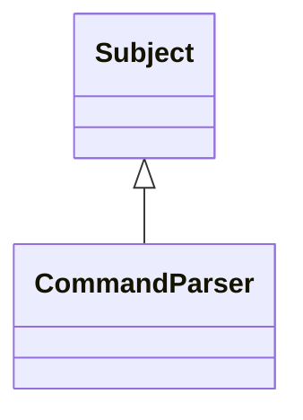

# Subject

**Namespace:** `UTILSLIB` &nbsp;·&nbsp; **Library:** Utilities Library

`#include <utils/observerpattern.h>`

```cpp
class UTILSLIB::Subject
```

DECLARE BASE CLASS SUBJECT.

The [`Subject`](/docs/api/utils/subject) class provides the base class of every subject of the observer design pattern.

```cpp title="src/examples/ex_utils/main.cpp"
// A subject notifies every attached observer; observers pull the state they need
class Counter : public Subject
{
public:
    void increment()
    {
        ++m_value;
        notify();
    }
    int value() const
    {
        return m_value;
    }

private:
    int m_value = 0;
};

class LastSeen : public IObserver
{
public:
    void update(Subject* pSubject) override
    {
        m_seen = static_cast<Counter*>(pSubject)->value();
    }
    int seen() const
    {
        return m_seen;
    }

private:
    int m_seen = -1;
};
```

### Inheritance



---

## Public Methods

### ~Subject()

Destroys the [`Subject`](/docs/api/utils/subject).

---

### attach(pObserver)

Attaches an observer to the subject.

**Parameters:**

- **pObserver** : *[IObserver](/docs/api/utils/i-observer) **
  pointer to the observer which should be attached to the subject.

---

### detach(pObserver)

Detaches an observer of the subject.

**Parameters:**

- **pObserver** : *[IObserver](/docs/api/utils/i-observer) **
  pointer to the observer which should be detached of the subject.

---

### notify()

Notifies all attached servers by calling there update method.

Is used when subject has updates to provide. This method is enabled when nothifiedEnabled is true.

---

### observers()

Returns attached observers.

**Returns:**

- *t_Observers &* — attached observers.

---

### observerNumDebug()

Returns attached observers.

**Returns:**

- *int* — attached observers. Returns number of attached observers.

---

## Example

- Full source: [`src/examples/ex_utils/main.cpp`](https://github.com/mne-tools/mne-cpp/tree/staging/src/examples/ex_utils/main.cpp)
- Build target: `ex_utils` (runs under CTest)

## Authors of this file

- Christoph Dinh &lt;christoph.dinh@mne-cpp.org&gt;
- Lorenz Esch &lt;lorenz.esch@tu-ilmenau.de&gt;
- Juan GPC &lt;jgarciaprieto@mgh.harvard.edu&gt;
- Gabriel Motta &lt;gabrielbenmotta@gmail.com&gt;
