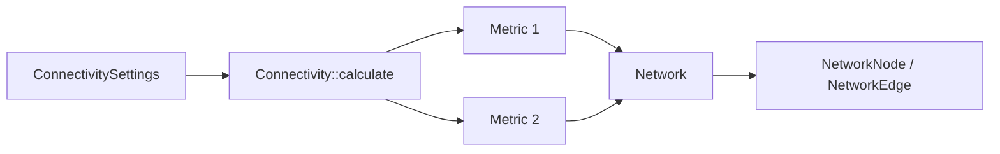

# Connectivity

The Connectivity library (`CONNLIB`) computes functional connectivity metrics, stores the resulting networks, and provides graph-theoretic utilities. It is implemented in pure C++ with real-time capability in mind and imposes no modality-specific constraints — the same API works for MEG, EEG, and source-level data.

## Architecture

The library is organized into three groups of classes:

| Group | Key Classes | Role |
|-------|-------------|------|
| **API** | `Connectivity`, `ConnectivitySettings` | User-facing entry point — configure inputs, select metrics, launch computation |
| **Metrics** | One class per metric (e.g., `ConnectivityPLI`) | Implement the spectral/statistical estimator for each measure |
| **Network containers** | `Network`, `NetworkNode`, `NetworkEdge` | Store and query the resulting connectivity graph |

### Data Flow



1. The user populates a `ConnectivitySettings` object with trial data, node positions, desired metrics, and sampling frequency.
2. `Connectivity::calculate()` dispatches each requested metric to its dedicated class.
3. Results are returned as one `Network` per metric, containing `NetworkNode` and `NetworkEdge` objects.

`NetworkEdge` instances are stored as smart pointers, which keeps memory usage manageable for large, fully connected graphs. `Network` also exposes functions for distance-matrix computation, basic graph measures, and weight-based thresholding.

### Trial-Based Computation

Connectivity is computed **across trials**, not across time. This design targets evoked-response experiments where data are segmented into stimulus-locked epochs. For resting-state recordings (no stimulus), the continuous data can be split into equally sized blocks and treated as pseudo-trials — a standard approach in resting-state connectivity studies.

:::note
Time-resolved (sample-by-sample) connectivity is not currently supported. Use the trial-based approach for spontaneous data.
:::

## Usage

The example below computes all-to-all Phase Lag Index (PLI) and Imaginary Coherence from MEG gradiometer epochs:

```cpp
// Prepare input data
FiffRawData raw("sample_audvis_raw.fif");
RowVectorXi picks = raw.info.pick_types("grad");
Eigen::MatrixXi events;
MNE::read_events("sample_audvis_raw-eve.fif", events);

// Read epochs: -100 ms to 400 ms relative to event type 3
MNEEpochDataList data;
data = MNEEpochDataList::readEpochs(raw, events, -0.1, 0.4, 3, picks);

// Configure connectivity
ConnectivitySettings settings;
settings.setNodePositions(raw.info, picks);
settings.setConnectivityMethods(QStringList() << "pli" << "imagcohy");
settings.setSamplingFrequency(raw.info.sfreq);
for (MNEEpochData::SPtr pItem : data)
    settings.append(pItem->epoch);

// Compute — returns one Network per metric
QList<Network> networks = Connectivity::calculate(settings);
```

Source-level connectivity works identically — pass source-localized signals instead of sensor-level data.

## Supported Metrics

| Metric | Keyword | Domain |
|--------|---------|--------|
| Correlation | `cor` | Time |
| Cross-Correlation | `xcor` | Time |
| Coherence | `coh` | Frequency |
| Imaginary Coherence | `imagcohy` | Frequency |
| Phase Locking Value | `plv` | Phase |
| Phase Lag Index | `pli` | Phase |
| Weighted Phase Lag Index | `wpli` | Phase |
| Unbiased Squared Phase Lag Index | `uspli` | Phase |
| Debiased Squared Weighted Phase Lag Index | `dswpli` | Phase |

## Class Inventory

### Metric Classes

Every metric inherits from `AbstractMetric` and implements the same computation interface, so new metrics can be added by subclassing.

| Class | Description | MNE-Python (`mne-connectivity`) |
|---|---|---|
| `AbstractMetric` | Base class providing common FFT, windowing, and trial-accumulation logic | `mne_connectivity.base` |
| `Coherence` | Frequency-domain magnitude-squared coherence | `spectral_connectivity_epochs(method='coh')` |
| `Coherency` | Complex-valued coherency (preserves phase information) | `spectral_connectivity_epochs(method='cohy')` |
| `ImagCoherence` | Imaginary part of coherency — robust to volume-conduction artefacts | `spectral_connectivity_epochs(method='imcoh')` |
| `Correlation` | Pearson correlation coefficient between signal pairs | `scipy.stats.pearsonr` |
| `CrossCorrelation` | Cross-correlation with lag analysis | `scipy.signal.correlate` |
| `PhaseLockingValue` | Phase-locking value — consistency of phase difference across trials | `spectral_connectivity_epochs(method='plv')` |
| `PhaseLagIndex` | Phase Lag Index — antisymmetric; insensitive to zero-lag conduction | `spectral_connectivity_epochs(method='pli')` |
| `WeightedPhaseLagIndex` | Weighted PLI — weights by magnitude of imaginary part | `spectral_connectivity_epochs(method='wpli')` |
| `UnbiasedSquaredPhaseLagIndex` | Variance-corrected squared PLI (uPLI²) | `spectral_connectivity_epochs(method='dpli')` |
| `DebiasedSquaredWeightedPhaseLagIndex` | Bias-corrected squared WPLI (dWPLI²) | `spectral_connectivity_epochs(method='wpli2_debiased')` |

### Network Containers

| Class | Description | MNE-Python |
|---|---|---|
| `Network` | Graph container with nodes, edges, connectivity matrix, and graph metrics (degree, distribution, thresholding) | `mne_connectivity.Connectivity` |
| `NetworkNode` | Single network node with 3D position and incident edge list | — |
| `NetworkEdge` | Weighted connection between two nodes with per-frequency-bin weights and threshold support | — |

### Settings & Data

| Class / Struct | Description |
|---|---|
| `ConnectivitySettings` | Complete computation configuration: input trial data, metric selection, sampling frequency, FFT size, window type, node positions |
| `ConnectivitySettings::IntermediateTrialData` | Per-trial frequency-domain data: raw spectra, cross-spectral matrices, tapered spectra |
| `ConnectivitySettings::IntermediateSumData` | Accumulated spectral data across all trials for final normalisation |
| `VisualizationInfo` | Colourmap, node/edge RGBA colours, and visualisation method settings |

### Static Entry Points

| Function | Description |
|---|---|
| `Connectivity::calculate(settings)` | Dispatches computation: returns one `Network` per requested metric |

## Algorithms Not Yet in MNE-CPP

| Algorithm | MNE-Python (`mne-connectivity`) | Description |
|---|---|---|
| Directed Transfer Function (DTF) | `spectral_connectivity_epochs(method='dtf')` | Granger-causality-based directed connectivity in frequency domain |
| Partial Directed Coherence (PDC) | `spectral_connectivity_epochs(method='pdc')` | Normalised directed coherence based on MVAR models |
| Granger Causality (GC) | `spectral_connectivity_epochs(method='gc')` | Time-domain Granger causality |
| Amplitude Envelope Correlation (AEC) | `mne_connectivity.envelope_correlation()` | Power envelope correlation with optional orthogonalisation |
| Coherence (time-resolved) | `spectral_connectivity_time()` | Sliding-window or Hilbert-based time-resolved connectivity |
| Power Envelope Correlation | `mne_connectivity.envelope_correlation()` | Broadband power envelope correlation for resting-state analysis |
| Multivariate Connectivity (MIC/MIM) | `spectral_connectivity_epochs(method='mic')` | Multivariate interaction measure for multi-channel connectivity |

## Doxygen Reference

For method signatures, inheritance diagrams, and source-level documentation see the auto-generated [**CONNLIB namespace**](https://mne-cpp.github.io/doxygen-api/namespaceCONNLIB.html) in the Doxygen API reference.

## See Also

- [Library API Overview](api) — All MNE-CPP libraries
- [DSP Library](api-dsp) — Signal processing (filtering, spectral analysis) used as input to connectivity
- [Inverse Library](api-inverse) — Source estimation for source-level connectivity
- [Disp3D Library](api-disp3d) — 3D network visualisation
- [mne-connectivity](https://mne.tools/mne-connectivity/stable/) — Python connectivity package for comparison
