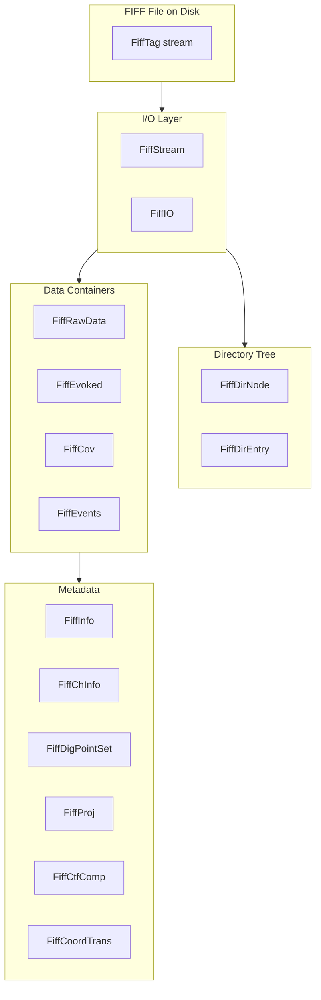

# Fiff Library (`FIFFLIB`)

The Fiff library implements the **FIFF (Functional Image File Format)** used throughout the MNE ecosystem for MEG/EEG data. It provides file I/O, in-memory data containers, channel and sensor metadata, digitisation points, coordinate transforms, SSP projections, and CTF compensation — everything required to read, manipulate, and write neurophysiological recordings. All classes reside in the `FIFFLIB` namespace and depend only on Qt and Eigen.

## Architecture



## Class Inventory

### File I/O

| Class | Description | MNE-Python | MNE-C |
|---|---|---|---|
| `FiffStream` | Low-level tag-based FIFF file reader/writer — open, read/write individual tags, navigate directory tree | `mne._fiff.open.fiff_open()` | `fiffFile` |
| `FiffIO` | High-level convenience reader/writer for complete measurement files | `mne.io.read_raw_fif()` | `mne_read_*()` family |
| `FiffTag` | Single data tag: kind, type, size, position, and typed payload | `mne._fiff.tag.Tag` | `fiffTag` |
| `FiffDirEntry` | Directory entry describing a tag's location within the file | `mne._fiff.tree` | `fiffDirEntry` |
| `FiffDirNode` | Tree node representing a block in the FIFF directory hierarchy (e.g., `FIFFB_MEAS`, `FIFFB_MNE_ENV`) | `mne._fiff.tree.dir_tree_find()` | `fiffDirTree` |
| `FiffId` | Universally unique file/block identifier (UUID + timestamp) | `mne._fiff.tag` | `fiffId` |

### Data Containers

| Class | Description | MNE-Python | MNE-C |
|---|---|---|---|
| `FiffRawData` | Raw continuous MEG/EEG data with lazy reading, ring-buffer support, projection, and compensation | `mne.io.Raw` | `mneRawData` |
| `FiffEvoked` | Averaged/evoked response data (channels × time) with stimulus metadata | `mne.Evoked` | `mneEvoked` |
| `FiffEvokedSet` | Collection of multiple evoked data sets read from a single file | `mne.read_evokeds()` | — |
| `FiffCov` | Noise or data covariance matrix (dense or diagonal) with eigendecomposition and channel names | `mne.Covariance` | `mneCov` |
| `FiffEvents` | Event array (sample × 3 matrix: sample, value-before, value-after) | `mne.read_events()` | — |
| `FiffNamedMatrix` | Matrix with labelled rows and columns, shared-data semantics | Internal | `mneNamedMatrix` |
| `FiffSparseMatrix` | Sparse matrix in Compressed Column/Row Storage | `scipy.sparse` equivalent | `mneSparseMatrix` |

### Channel & Sensor Information

| Class | Description | MNE-Python | MNE-C |
|---|---|---|---|
| `FiffInfo` | Complete measurement metadata: channels, sampling rate, SSP projections, CTF data, coordinate transforms, subject info, date | `mne.Info` | `mneMeasData` |
| `FiffInfoBase` | Lightweight base class for measurement info (channel list, bads, sampling rate) | `mne.Info` (base interface) | — |
| `FiffChInfo` | Per-channel metadata: name, type (MEG/EEG/STIM/…), unit, calibration, location | `mne.Info['chs'][i]` | `fiffChInfo` |
| `FiffChPos` | Sensor position and orientation: integration-point location + two ex/ey vectors | `mne.Info['chs'][i]['loc']` | `fiffChPos` |

### Digitisation & Spatial Data

| Class | Description | MNE-Python | MNE-C |
|---|---|---|---|
| `FiffDigPoint` | Single digitised point: kind (cardinal/HPI/EEG/extra), ident, 3D position | `mne._fiff._digitization.DigPoint` | `fiffDigPoint` |
| `FiffDigPointSet` | Ordered collection of digitiser points with coordinate transform support | `mne.Info['dig']` | — |
| `FiffDigitizerData` | Digitiser point set with associated head-to-device transformation | `mne.Info['dig']` + transforms | — |
| `FiffCoordTrans` | Rigid-body coordinate transformation (4 × 4 homogeneous matrix) between two frames | `mne.transforms.Transform` | `fiffCoordTrans` |
| `FiffCoordTransSet` | Chain of transforms (e.g., head → MRI → MNI Talairach) | `mne.transforms` collection | — |

### Calibration & Correction

| Class | Description | MNE-Python | MNE-C |
|---|---|---|---|
| `FiffProj` | Signal Space Projection (SSP) operator — one projection vector with kind and description | `mne.Projection` | `mneProj` |
| `FiffCtfComp` | CTF software gradient compensation data: compensation matrix and calibration | `mne.Info['comps']` | `mneCtfComp` |

**Key utility methods on `FiffInfo`:**
- `make_compensator()` — create a compensation matrix for a given grade
- `get_current_comp()` — query active CTF compensation setting
- `make_projector()` — build an SSP projector from active projections
- `pick_types()` / `pick_channels()` — channel selection by type or name

### Constants & Types

| Header | Description | MNE-Python | MNE-C |
|---|---|---|---|
| `fiff_constants.h` | All FIFF block, tag, and value identifiers (`FIFFB_*`, `FIFF_*`, `FIFFV_*`) | `mne._fiff.constants.FIFF` | `mne_fiff.h` |
| `fiff_types.h` | Primitive FIFF types: `fiff_int_t`, `fiff_float_t`, `fiff_byte_t`, DAU pack types | — | `mne_types.h` |
| `fiff_explain.h` | Human-readable string maps for FIFF constants (block type → name, tag kind → name) | — | — |

## Usage Example

```cpp
#include <fiff/fiff.h>

using namespace FIFFLIB;

// Open a raw FIFF file
QFile file("sample_audvis_raw.fif");
FiffStream::SPtr stream(new FiffStream(&file));
FiffRawData raw(stream);

// Query measurement info
qDebug() << "Sample rate:" << raw.info.sfreq;
qDebug() << "Channels:"   << raw.info.nchan;
qDebug() << "Bad channels:" << raw.info.bads;

// Read a time window [0 s, 10 s]
Eigen::MatrixXd data;
Eigen::RowVectorXd times;
raw.read_raw_segment(data, times, 0, raw.info.sfreq * 10);

// Apply SSP projectors
FiffProj::activate_projs(raw.info.projs);
Eigen::MatrixXd proj;
int nproj;
FiffProj::make_projector(raw.info.projs, raw.info.ch_names, proj, nproj);
data = proj * data;

// Read evoked data
QList<FiffEvoked> evokeds = FiffEvoked::read("sample_audvis-ave.fif");

// Read noise covariance
FiffCov cov = FiffCov::read("sample_audvis-cov.fif");
```

## Algorithms Not Yet in MNE-CPP

| Feature | MNE-Python | Description |
|---|---|---|
| Annotations | `mne.Annotations` | Time-stamped labels for raw data segments (e.g., BAD, EDGE) |
| BDF/EDF reader | `mne.io.read_raw_edf()` | Native FIFF wrapping of BDF/EDF+ format |
| BrainVision reader | `mne.io.read_raw_brainvision()` | BrainVision .vhdr/.vmrk/.eeg reader |
| Fieldtrip reader | `mne.io.read_raw_fieldtrip()` | FieldTrip .mat file reader |
| Montage | `mne.channels.DigMontage` | Standard montage and custom electrode placement |

:::note
MNE-CPP handles non-FIFF formats via the dedicated command-line converter tools (e.g., `mne_edf2fiff`, `mne_brain_vision2fiff`, `mne_ctf2fiff`). See the [Conversion tools](../manual/tools-edf2fiff).
:::

## Doxygen Reference

For method signatures, inheritance diagrams, and source-level documentation see the auto-generated [**FIFFLIB namespace**](https://mne-cpp.github.io/doxygen-api/namespaceFIFFLIB.html) in the Doxygen API reference.

## See Also

- [Library API Overview](api) — All MNE-CPP libraries
- [Mne Library](api-mne) — Core MNE data structures built on Fiff
- [FIFF File Format](../manual/fiff-format) — Specification of the FIFF binary format
- [MNE-Python I/O Reference](https://mne.tools/stable/generated/mne.io.Raw.html) — Python equivalent
