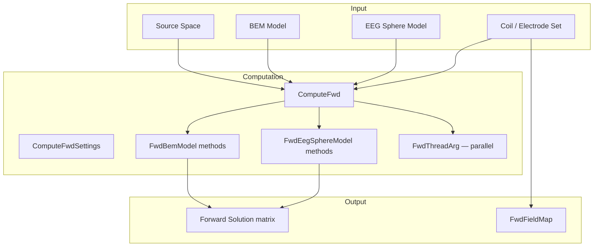

# Forward Library (`FWDLIB`)

The Forward library computes MEG and EEG forward solutions — the mapping from source currents in the brain to sensor measurements. It supports BEM (Boundary Element Method) models with constant or linear collocation, multi-layer concentric-sphere EEG head models, and arbitrary coil/electrode configurations. The library also provides sensor-to-surface field mapping for topographic interpolation. All classes reside in the `FWDLIB` namespace.

## Architecture



## Class Inventory

### Forward Solution

| Class | Description | MNE-Python | MNE-C |
|---|---|---|---|
| `Fwd` | Static wrapper for reading forward solutions from FIFF files | `mne.read_forward_solution()` | `mne_read_forward_solution` |
| `ComputeFwd` | Main worker that orchestrates forward solution computation: initialises source space, BEM/sphere model, coils, and dispatches computation to threads | `mne.make_forward_solution()` | Forward solver kernel |
| `ComputeFwdSettings` | Container for all forward computation parameters: source space path, BEM path, EEG model, coordinate frame | — | Configuration struct |

### BEM (Boundary Element Method)

| Class | Description | MNE-Python | MNE-C |
|---|---|---|---|
| `FwdBemModel` | BEM model holding tissue surfaces (scalp, outer skull, inner skull), conductivity parameters, and the BEM solution matrix | `mne.make_bem_model()` / `mne.read_bem_solution()` | `fwdBemModel` |
| `FwdBemSolution` | Precomputed BEM solution matrix (n_coil × n_potential_points) mapping infinite-medium potentials to sensor readings | Internal | `fwdBemSolution` |

**Key BEM Methods:**

| Method | Description |
|---|---|
| `fwd_bem_constant_collocation_solution()` | Compute BEM solution using constant-basis collocation on triangle centroids |
| `fwd_bem_linear_collocation_solution()` | Compute BEM solution using linear-basis collocation on triangle vertices |
| `fwd_bem_inf_field()` / `fwd_bem_inf_pot()` | Compute the magnetic field / electric potential in an infinite homogeneous medium |
| `fwd_bem_solid_angles()` | Compute solid-angle matrix for the BEM geometry |
| `fwd_bem_pot_calc()` / `fwd_bem_lin_pot_calc()` | Compute potentials at electrodes given BEM solution (constant / linear collocation) |
| `fwd_bem_pot_grad_calc()` | Compute potentials and spatial gradients at electrodes |
| `make_guesses()` | Generate dipole guess-point grid within the inner-skull boundary |

### Coils & Sensors

| Class | Description | MNE-Python | MNE-C |
|---|---|---|---|
| `FwdCoil` | Single MEG coil or EEG electrode: integration points, weights, orientation, coordinate frame | Internal (via `pick_info`) | `fwdCoil` |
| `FwdCoilSet` | Collection of `FwdCoil` objects representing the full sensor array; supports creation from channel info and transformation between coordinate frames | `fwd['info']` | `fwdCoilSet` |
| `FwdCompData` | CTF compensation coils and field computation routines for gradiometer-to-magnetometer compensation | `mne.io.CompensationGrade` | `fwdCompData` |

**Key Coil Methods:**

| Method | Description |
|---|---|
| `create_meg_coils()` | Create MEG coil set from measurement info and coordinate transform |
| `create_eeg_els()` | Create EEG electrode set from measurement info |
| `read_coil_defs()` | Read coil definitions from `coil_def.dat` |
| `is_axial_coil()` / `is_planar_coil()` / `is_magnetometer_coil()` | Query coil geometry type |
| `dup_coil_set(transform)` | Duplicate coil set and apply a coordinate transform |

### EEG Sphere Model

| Class | Description | MNE-Python | MNE-C |
|---|---|---|---|
| `FwdEegSphereLayer` | Single concentric sphere layer with radius (relative to outermost) and conductivity | Layer in `eeg_sphere_model` | `fwdEegSphereLayer` |
| `FwdEegSphereModel` | Multi-layer spherical head model for EEG forward computation using Legendre polynomial series expansion | `mne.make_sphere_model()` | `fwdEegSphereModel` |
| `FwdEegSphereModelSet` | Collection of EEG sphere models (e.g., default four-shell plus user-defined) | — | `fwdEegSphereModelSet` |

**Key Sphere Methods:**

| Method | Description |
|---|---|
| `setup_eeg_sphere_model()` | Initialise Berg-Scherg equivalent parameters via optimisation |
| `eeg_multi_sphere_pot()` | Compute scalp potential for a current dipole using Legendre series |
| `next_legen()` | Legendre polynomial recursion helper (P, P') for series evaluation |
| `fwd_eeg_get_multi_sphere_model_coeff()` | Compute series expansion coefficients for the multi-layer geometry |

### Field Mapping / Interpolation

| Class | Description | MNE-Python | MNE-C |
|---|---|---|---|
| `FwdFieldMap` | Sphere-model-based sensor-to-surface field mapping using Legendre polynomials and SVD pseudo-inverse; supports MEG and EEG with optional SSP projection | `mne.forward._field_interpolation._make_surface_mapping()` | — (ported from Python) |

**Key Methods:**

| Method | Description |
|---|---|
| `computeMegMapping()` | Compute dense sensor → surface mapping matrix for MEG |
| `computeEegMapping()` | Compute dense sensor → surface mapping matrix for EEG (with average reference option) |

### Parallelisation

| Class | Description | MNE-Python | MNE-C |
|---|---|---|---|
| `FwdThreadArg` | Thread-local workspace for parallel forward computation: source range, coils, result buffer, field function pointers | Implicit in parallel loops | `fwdThreadArg` |

**Function pointer types for field callbacks:**

| Type | Signature |
|---|---|
| `fwdFieldFunc` | `(rd, Q, coils, result, client) → int` — single dipole, single orientation |
| `fwdVecFieldFunc` | `(rd, coils, result_3col, client) → int` — single dipole, all 3 orientations |
| `fwdFieldGradFunc` | `(rd, Q, coils, result, xgrad, ygrad, zgrad, client) → int` — field + spatial gradients |

## Usage Example

```cpp
#include <fwd/fwd.h>
#include <fwd/compute_fwd/compute_fwd.h>
#include <fwd/compute_fwd/compute_fwd_settings.h>

using namespace FWDLIB;

// Option A: Read an existing forward solution
MNEForwardSolution fwd = Fwd::read_forward_solution(
    "sample_audvis-meg-eeg-oct-6-fwd.fif");

// Option B: Compute from scratch
ComputeFwdSettings settings;
settings.srcname   = "sample-oct-6-src.fif";
settings.bemname   = "sample-5120-5120-5120-bem-sol.fif";
settings.measname  = "sample_audvis_raw.fif";
settings.eeg       = true;
settings.meg       = true;

ComputeFwd compute(&settings);
compute.calculateFwd();  // result stored in compute.fwdSolution

// Option C: Sensor-to-surface field mapping
Eigen::MatrixXd megMapping =
    FwdFieldMap::computeMegMapping(info, trans, surface, sphereModel);
```

## Algorithms Not Yet in MNE-CPP

| Feature | MNE-Python | Description |
|---|---|---|
| OpenMEEG BEM | `mne.make_forward_solution(solver='openmeeg')` | BEM via OpenMEEG library — more accurate for complex geometries |
| Finite Element Forward | External (SimNIBS) | FEM-based forward modelling for realistic tissue boundaries |
| Dipole Patch Statistics | `mne.forward.compute_depth_prior()` | Depth-weighting priors for regularisation of deep sources |
| Sensitivity Map (full) | `mne.sensitivity_map()` | Column-norm map of lead-field matrix for source-space coverage analysis |

## See Also

- [Library API Overview](api) — All MNE-CPP libraries
- [Mne Library](api-mne) — Source spaces and BEM surfaces used by the Forward library
- [Inverse Library](api-inverse) — Source estimation using the forward solution
- [Forward Modelling Background](../manual/forward) — Theory and equations behind forward computation
- [Forward Solution Tool](../manual/tools-forward-solution) — CLI tool `mne_forward_solution`
- [MNE-Python Forward API](https://mne.tools/stable/generated/mne.make_forward_solution.html)
