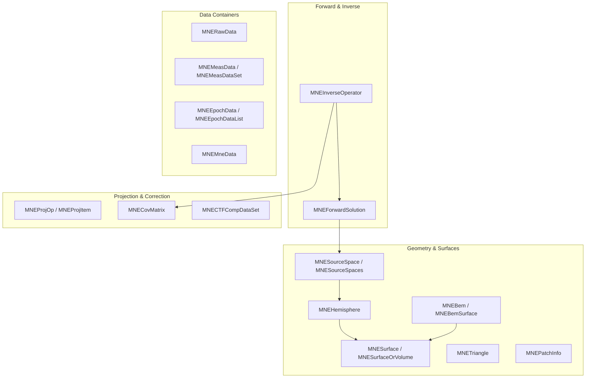

# Mne Library (`MNELIB`)

The Mne library contains the core neuroscience data structures used throughout MNE-CPP — source spaces, source estimates, forward solutions, inverse operators, hemispheres, BEM surfaces, covariance matrices, epochs, projections, and many supporting geometry types. It is the C++ counterpart of the structures defined in the original MNE-C `libmne` and the core `mne` Python package. All classes reside in the `MNELIB` namespace.

## Architecture

The library mirrors the data model of the original MNE software closely. Most classes are direct C++ translations of the MNE-C structs with added Qt/Eigen integration.



## Class Inventory

### Source Spaces

| Class | Description | MNE-Python | MNE-C |
|---|---|---|---|
| `MNESourceSpace` | Single surface or volume source space with vertex positions, normals, triangles, and neighbour lists | `SourceSpaces[0]` | `mneSurfaceOrVolume` |
| `MNESourceSpaces` | Container for multiple source spaces (typically left + right hemisphere) | `mne.SourceSpaces` | Multiple `mneSurfaceOrVolume` |
| `MNEHemisphere` | Cortical hemisphere source space with patch clustering and decimated vertex sets | Via `SourceSpaces` | `mneSurfaceOrVolume` |
| `MNESurfaceOrVolume` | Base class for any surface or volume mesh with common geometry fields | Base of `SourceSpaces` | `mneSurfaceOrVolume` |

### Surfaces & Geometry

| Class | Description | MNE-Python | MNE-C |
|---|---|---|---|
| `MNESurface` | Triangulated surface mesh (vertices, normals, triangles) | `read_surface()` | `mneSurface` |
| `MNETriangle` | Per-triangle data: edge vectors, face normal, area, centroid | Internal | `mneTriangle` |
| `MNEVolGeom` | Volume geometry: voxel-to-RAS transforms, dimensions, voxel size | `VolSourceEstimate` metadata | `mneVolGeom` |
| `MNEPatchInfo` | Cortical patch: member vertices, area, average normal deviation | `Label` (partial) | `mnePatchInfo` |
| `MNENearest` | Nearest-neighbour record linking original vertices to decimated source points | Adjacency matrices | `mneNearest` |
| `MNEClusterInfo` | Cluster assignment with labels and statistics | `mne.stats.cluster_level` results | `mneClusterInfo` |

### BEM Surfaces

| Class | Description | MNE-Python | MNE-C |
|---|---|---|---|
| `MNEBem` | BEM model container holding multiple tissue surfaces | `mne.read_bem_solution()` | Multiple `mneBemSurface` |
| `MNEBemSurface` | Single BEM surface (scalp, outer skull, inner skull) with conductivity and triangle metadata | BEM surface in solution | `mneBemSurface` |

### Forward & Inverse Operators

| Class | Description | MNE-Python | MNE-C |
|---|---|---|---|
| `MNEForwardSolution` | Lead-field matrix with geometry, channel info, and source space reference | `mne.Forward` / `mne.read_forward_solution()` | `mneForwardSolution` |
| `MNEInverseOperator` | SVD-decomposed whitened lead field with source and noise covariance | `mne.minimum_norm.InverseOperator` | `mneInverseOperator` |

### Raw Data & Measurement

| Class | Description | MNE-Python | MNE-C |
|---|---|---|---|
| `MNERawData` | Raw continuous data with filtering, projection, and CTF/SSS compensation | `mne.io.Raw` | `mneRawData` |
| `MNERawInfo` | Metadata about raw data (sampling rate, channels, transforms) | `Raw.info` | `mneRawInfo` |
| `MNERawBufDef` | Buffer segment definition for memory-mapped raw data access | Internal | `mneRawBufDef` |
| `MNEMeasData` | Measurement data container with associated inverse data | `mne.Evoked` / `mne.Epochs` | `mneMeasData` |
| `MNEMeasDataSet` | Single measurement epoch with data matrix and metadata | Per-epoch data | `mneMeasDataSet` |
| `MNEEpochData` | Single trial epoch with time range and artifact rejection status | Item in `mne.Epochs` | `mneEpochData` |
| `MNEEpochDataList` | List of epochs with rejection thresholds, baseline, and I/O routines | `mne.Epochs` | Multiple `mneEpochData` |
| `MNEMneData` | Computed MNE inverse data: projection, prediction, SNR, regularisation parameters | Attributes in `SourceEstimate` | `mneMneData` |

### Morph Maps & Surface Operations

| Class | Description | MNE-Python | MNE-C |
|---|---|---|---|
| `MNEMorphMap` | Vertex-to-vertex mapping between two FreeSurfer surfaces for morphing source estimates | `mne.read_morph_map()` | `morphMapRec` |
| `MNESurfacePatch` | Patch linking vertices to a source point on cortical surface | Embedded in `SourceSpaces` | Part of `mnePatchInfo` |
| `MNEProjectToSurface` | Projection of arbitrary 3D points onto a triangulated surface mesh | `_project_onto_surface()` | `mne_project_to_surface` |
| `MNEIcp` | Iterative Closest Point algorithm for point-cloud-to-surface registration (co-registration) | ICP via `mne.coreg` | — |

### Projection & Compensation

| Class | Description | MNE-Python | MNE-C |
|---|---|---|---|
| `MNEProjOp` | SSP projection operator managing multiple projection items | `mne.read_proj()` | `mneLinspace` |
| `MNEProjItem` | Single SSP vector with kind, description, and active flag | One SSP component | `mneLinspaceRec` |
| `MNEProjData` | Precomputed auxiliary projection data for efficient repeated application | Internal | — |
| `MNECovMatrix` | Noise or source covariance with eigendecomposition, channel sub-selection, and whitening | `mne.Covariance` | `mneCovMatrix` |
| `MNECTFCompData` | Single CTF compensation element (matrix + metadata) | `mne.Info['comps'][i]` | `mneCTFCompData` |
| `MNECTFCompDataSet` | Collection of CTF compensation matrices | `apply_gradient_compensation()` | Multiple `mneCTFCompData` |
| `MNESssData` | Maxwell filtering (SSS) data for gradiometer/magnetometer reduction | SSS via `maxwell_filter()` | `mneSssData` |

### Derivations & Channels

| Class | Description | MNE-Python | MNE-C |
|---|---|---|---|
| `MNEDeriv` | Single virtual channel derivation with sparse coefficient vector | Custom channels | `mneDeriv` |
| `MNEDerivSet` | Collection of channel derivations | — | Multiple `mneDeriv` |
| `MNEChSelection` | Channel selection with regex pattern and picked indices | `pick_channels()` | `mneChSelection` |

### Named Matrices & Vectors

| Class | Description | MNE-Python | MNE-C |
|---|---|---|---|
| `MNENamedMatrix` | Dense matrix with labelled row and column names | Internal | `mneNamedMatrix` |
| `MNENamedVector` | Vector with element names | Internal | `mneNamedVector` |
| `MNESparseNamedMatrix` | Sparse matrix with labelled rows/columns | Internal | `mneSparseNamedMatrix` |

### Visualisation Helpers

| Class | Description | MNE-Python | MNE-C |
|---|---|---|---|
| `MNEMshDisplaySurface` | Surface mesh for 3D rendering with colour mapping and morphing | `Brain` / `add_surface()` | `mshDisplaySurface` |
| `MNEMshDisplaySurfaceSet` | Collection of display surfaces for multi-hemisphere visualisation | Brain surfaces | Multiple `mshDisplaySurface` |
| `MNEMshLight` / `MNEMshLightSet` | Light sources for 3D scene | Lighting config | `mshLight` |
| `MNEMshEyes` | Camera/eye position for 3D rendering | Camera viewpoint | `mshEyes` |
| `MNEMshPicked` | Picked vertex on displayed surface (index, coordinates, value) | Click selection | `mshPicked` |
| `MNEMshColorScaleDef` | Colour scale definition with value range and colour mapping | Colormap | `mshColorScaleDef` |
| `MNELayout` / `MNELayoutPort` | 2D channel layout for topographic displays | `mne.channels.read_layout()` | `mneLayout` |

### Events & Triggers

| Class | Description | MNE-Python | MNE-C |
|---|---|---|---|
| `MNEEvent` | Single trigger/stimulus event marker with sample, before, and after values | Event tuple | `mneEvent` |
| `MNEEventList` | Ordered collection of event markers | `mne.read_events()` results | Multiple `mneEvent` |

### File I/O & Utilities

| Class | Description | MNE-Python | MNE-C |
|---|---|---|---|
| `MNEDescriptionParser` | Parser for MNE-C style `.ave` and `.cov` description files | — | `interpret.c` |
| `MNEProcessDescription` | Parsed averaging/covariance process description data | — | — |
| `MNEFilterDef` | Filter definition (highpass, lowpass, notch parameters) | Filter specs | `mneFilterDef` |

### Clustering

| Class | Description | MNE-Python | MNE-C |
|---|---|---|---|
| `RegionData` / `RegionMT` | Input parameters for KMeans-based cortical region clustering | `mne.SourceSpaces` clustering | — |
| `RegionDataOut` / `RegionMTOut` | Output of KMeans-based source clustering on cortical regions | Cluster results | — |

### Static Utility Class

| Class | Description |
|---|---|
| `MNE` | Static utility wrapper providing MATLAB-toolbox-like functions: `combine_xyz()`, `find_source_space_hemi()`, `make_compensator()`, `get_current_comp()`, `make_block_diag()`, `read_events()`, `setup_volume_source_space()` |

## Usage Example

```cpp
#include <mne/mne.h>

using namespace MNELIB;
using namespace FIFFLIB;

// Read source spaces
MNESourceSpaces srcSpaces;
MNE::read_source_spaces("sample-src.fif", srcSpaces);

qDebug() << "Hemispheres:" << srcSpaces.size();
qDebug() << "LH vertices:" << srcSpaces[0].nuse;
qDebug() << "RH vertices:" << srcSpaces[1].nuse;

// Read forward solution
MNEForwardSolution fwd =
    MNEForwardSolution::read("sample_audvis-meg-eeg-oct-6-fwd.fif");

// Read inverse operator
MNEInverseOperator invOp =
    MNEInverseOperator::read("sample_audvis-meg-eeg-oct-6-inv.fif");

// Read epochs
FiffRawData raw("sample_audvis_raw.fif");
Eigen::MatrixXi events;
MNE::read_events("sample_audvis_raw-eve.fif", events);

MNEEpochDataList epochs;
epochs = MNEEpochDataList::readEpochs(raw, events,
                                       -0.2, 0.5, /*eventType=*/1);
```

## See Also

- [Library API Overview](api) — All MNE-CPP libraries
- [Fiff Library](api-fiff) — FIFF file I/O that feeds into Mne data structures
- [Forward Library](api-fwd) — Forward modelling built on Mne source spaces and BEM
- [Inverse Library](api-inverse) — Source estimation using Mne operators
- [MNE-Python Data Structures](https://mne.tools/stable/generated/mne.SourceSpaces.html)
