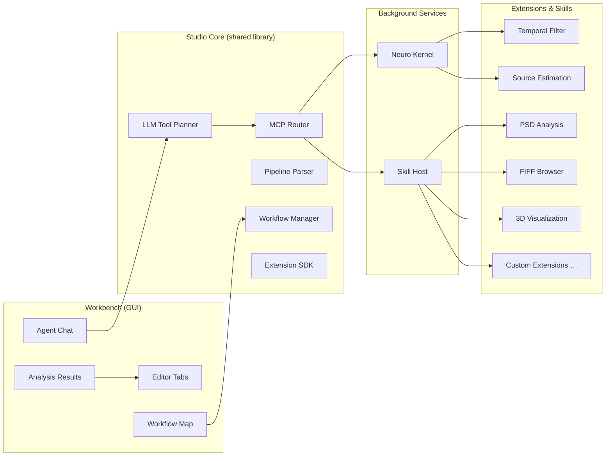

# MNE Analyze Studio

:::tip Preview
MNE Analyze Studio is in active development and not yet part of the stable release. The architecture described below is implemented on the `staging` branch.
:::

MNE Analyze Studio is an **agent-oriented analysis workbench** designed to combine the analysis capabilities of MNE-CPP with LLM-driven automation. It follows a modular, microservice-inspired architecture: a central **Workbench** GUI hosts extension views, while a **Neuro Kernel** provides analysis tools and a **Skill Host** orchestrates multi-step workflows through an LLM planner.

## Architecture



## Components

### Workbench

The main GUI, styled after modern IDE workbenches. It provides:

- **Editor tabs** for viewing raw data, analysis results, and extension-hosted views
- **Agent chat panel** for natural-language interaction with the LLM planner
- **Analysis result widget** for displaying source estimates, PSD plots, and other outputs
- **Workflow mini-map** showing the current analysis pipeline as a directed graph
- **Extension settings** for configuring individual skill and extension parameters

### Studio Core

A shared library (`mne_analyze_studio_core`) that all components link against:

| Module | Purpose |
|---|---|
| **MCP Router** | JSON-RPC message routing between the Workbench, Neuro Kernel, and Skill Host via local sockets |
| **LLM Tool Planner** | Translates natural-language requests into tool-call sequences using an LLM backend |
| **Workflow Manager** | Tracks analysis pipelines as directed acyclic graphs of tool invocations |
| **Pipeline Parser** | Reads and writes declarative analysis pipeline definitions |
| **Capability Catalog** | Discovers and registers tool capabilities from extensions at runtime |
| **Extension SDK** | Interfaces and registries for building custom extensions and view providers |

### Neuro Kernel

A background service (`mne_neuro_kernel`) that exposes MNE-CPP's analysis libraries over a local JSON-RPC socket. It wraps the Dsp, Inv, Fwd, and Fiff libraries into callable **tools** that the LLM planner can invoke:

- Temporal filtering (FIR, IIR, band-pass, notch)
- Source estimation (MNE, dSPM, sLORETA, beamformers)
- Forward solution computation
- Covariance estimation
- Power spectral density
- Connectivity metrics

### Skill Host

A background service (`mne_skill_host`) that manages **skills** — self-contained analysis units with their own manifests, input/output contracts, and view factories. Skills register themselves with the Capability Catalog and can be composed into multi-step workflows.

### Extensions

Extensions are dynamically loaded shared libraries that provide analysis capabilities and optional view widgets:

| Extension | Description |
|---|---|
| **Temporal Filter Skill** | Band-pass, high-pass, low-pass, and notch filtering with live preview |
| **Source Estimation Skill** | MNE/dSPM/sLORETA inverse computation with configurable regularization |
| **PSD Analysis Extension** | Welch-method power spectral density with interactive frequency selection |
| **FIFF Browser Extension** | Raw FIFF data viewer with scrolling, scaling, and channel selection |
| **3D Visualization Extension** | Cortical surface, BEM, and source estimate rendering (desktop only) |

## Building

MNE Analyze Studio is built as part of the standard MNE-CPP build:

```bash
cmake --build build --target mne_analyze_studio_workbench --parallel
```

Individual components can also be built separately:

```bash
cmake --build build --target mne_neuro_kernel --parallel
cmake --build build --target mne_skill_host --parallel
```

:::note WebAssembly
The Neuro Kernel and most extensions build for WebAssembly. The Workbench, FIFF Browser Extension, and 3D Visualization Extension require desktop Qt and are excluded from WASM builds.
:::

## Writing a Custom Extension

Extensions implement the `IExtensionViewFactory` interface from the Studio SDK:

1. Create a shared library that links against `mne_analyze_studio_core`
2. Implement `IExtensionViewFactory` to provide a widget for the Workbench editor area
3. Provide an `ExtensionManifest` declaring your extension's capabilities, inputs, and outputs
4. Register your factory with the `ExtensionViewFactoryRegistry`

The Capability Catalog will discover your extension at startup and make its tools available to the LLM planner and workflow manager.

## See Also

- [MNE Analyze](analyze) — The classic plugin-based analysis GUI
- [Library API](../development/api) — Detailed documentation of the underlying C++ libraries
- [DSP Library](../development/api-dsp) — Signal processing algorithms available to extensions
