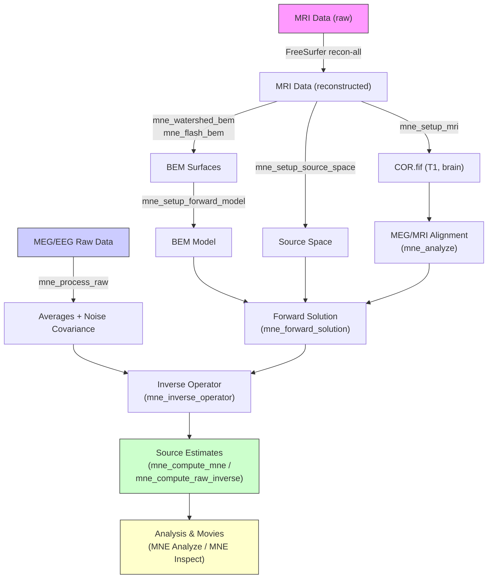

# The Cookbook

This section describes the typical workflow for producing minimum-norm estimates using MNE-CPP. The workflow is summarized in the diagram below.



## Selecting the Subject

Before starting the data analysis, set up the environment variable `SUBJECTS_DIR` to the directory under which the anatomical MRI data are stored. Optionally, set `SUBJECT` to the name of the subject's MRI data directory under `SUBJECTS_DIR`. With this setting you can avoid entering the `--subject` option common to many MNE programs and scripts.

In the following sections, files in the FreeSurfer directory hierarchy are usually referred to without specifying the leading directories. Thus, `bem/sample-7-src.fif` refers to the file `$SUBJECTS_DIR/$SUBJECT/bem/sample-7-src.fif`.

It is also recommended that the FreeSurfer environment is set up before using the MNE software.

## Cortical Surface Reconstruction with FreeSurfer

The first processing stage is the creation of various surface reconstructions with [FreeSurfer](https://surfer.nmr.mgh.harvard.edu/). The recommended FreeSurfer workflow is summarized on the [FreeSurfer wiki](https://surfer.nmr.mgh.harvard.edu/fswiki/RecommendedReconstruction).

## Setting Up the Anatomical MR Images

The FIFF files describing the anatomical MRI data are created using [`mne_setup_mri`](tools-setup-mri):

```bash
mne_setup_mri --subject duck_donald --mri T1
```

This command processes the MRI data set T1 for subject `duck_donald`. The script creates the directories `mri/<name>-neuromag/slices` and `mri/<name>-neuromag/sets`, and creates a corresponding FIFF file `COR.fif` in the appropriate sets directory.

If the input MRI data are stored in the newer MGZ format, the output FIFF file will include the MRI pixel data as well. If available, the coordinate transformations to allow conversion between the MRI (Surface RAS) coordinates and MNI and FreeSurfer Talairach coordinates are copied to the MRI description file.

:::tip
If the `SUBJECT` environment variable is set, it is usually sufficient to run `mne_setup_mri` without any options.
:::

## Setting Up the Source Space

This stage creates a decimated dipole grid on the white matter surface and the source space file in FIFF format. This is accomplished with [`mne_make_source_space`](tools-make-source-space):

```bash
mne_make_source_space --subject duck_donald --spacing 5
```

This creates a source space with 5 mm grid spacing. The files are created in the `bem` directory:

- `<subject>-<spacing>-src.fif` — source space description in FIFF format
- `<subject>-<spacing>-lh.pnt` / `rh.pnt` — source space points in text format

### Icosahedron-based source spaces

Instead of using spacing-based decimation, source spaces can be created using recursively subdivided icosahedra or octahedra:

| Subdivision | Sources per hemisphere | Approx. spacing (mm) | Surface area per source (mm²) |
|---|---|---|---|
| `-5` (oct) | 1,026 | 9.9 | 97 |
| `4` (ico) | 2,562 | 6.2 | 39 |
| `-6` (oct) | 4,098 | 4.9 | 24 |
| `5` (ico) | 10,242 | 3.1 | 9.8 |

:::tip
After the geometry is set up, check that the source space points are located on the cortical surface by loading the `COR.fif` file into a viewer and overlaying the corresponding `.pnt` or `.dip` files.
:::

## Creating the BEM Model Meshes

Calculation of the forward solution using the boundary-element model (BEM) requires that the surfaces separating regions of different electrical conductivities are tessellated. The MNE BEM software employs triangular tessellations.

For MEG computations, a reasonably accurate solution can be obtained by using a single-compartment BEM assuming the shape of the intracranial volume. For EEG, the standard model contains the intracranial space, the skull, and the scalp.

### Standard surface files

The following files should be present in the subject's `bem` directory (as actual files or symbolic links):

| FreeSurfer surface | ASCII equivalent | Contents |
|---|---|---|
| `inner_skull.surf` | `inner_skull.tri` | Inner skull triangulation |
| `outer_skull.surf` | `outer_skull.tri` | Outer skull triangulation |
| `outer_skin.surf` | `outer_skin.tri` | Head surface triangulation |

BEM surfaces can be created using:
- [`mne_watershed_bem`](tools-watershed-bem) — watershed algorithm on T1 MRI
- [`mne_flash_bem`](tools-flash-bem) — multi-echo FLASH MRI sequences (often better skull surfaces)

## Setting Up the Boundary-Element Model

This step is automated with [`mne_setup_forward_model`](tools-setup-forward-model):

```bash
# Three-layer BEM model (for MEG + EEG)
mne_setup_forward_model --subject duck_donald --surf --ico 4

# Single-compartment model (for MEG only, faster)
mne_setup_forward_model --subject duck_donald --surf --ico 4 --homog
```

### Default conductivity values

| Compartment | Default (S/m) | Ratio |
|---|---|---|
| Scalp | 0.3 | 1 |
| Brain | 0.3 | 1 |
| Skull | 0.006 | 1/50 |

The skull conductivity ratio is a subject of discussion in the literature. Published values range from 1:15 to 1:50. The MNE default ratio of 1:50 is based on values reported in Gonçalves et al. (2003).

The resulting files are created in the `bem` directory:
1. BEM geometry file (`*-bem.fif`)
2. Surface point files for verification (`*.pnt`, `*.surf`)
3. BEM solution file (`*-bem-sol.fif`) — this step can be skipped with `--nosol` for quick geometry verification

:::tip
Check BEM surfaces against the anatomical MRI before computing the (time-consuming) BEM solution. Use `--nosol` first, verify, then run again without `--nosol`.
:::

:::tip
Use [`mne_check_surface`](tools-check-surface) to validate BEM surfaces for topological correctness before proceeding.
:::

:::note
Up to this point, all processing stages depend on anatomical (geometrical) information only and remain identical across different MEG studies.
:::

## Preprocessing the Raw Data

The following MEG and EEG data preprocessing steps are recommended:

### 1. Fixing channel information

EEG electrode locations and magnetometer coil identifiers may need correction using [`mne_mark_bad_channels`](tools-mark-bad-channels).

### 2. Designating bad channels

Channels that are not functioning properly should be excluded from the analysis by marking them bad:

```bash
mne_mark_bad_channels --bad MEG2332 --bad EEG053 sample_audvis_raw.fif
```

**Recommended ways to identify bad channels:**
- Observe data quality during acquisition and note malfunctioning channels
- View on-line averages and check channel condition
- Compute preliminary off-line averages and inspect channels
- View raw data without SSP or EEG average reference

:::important
It is strongly recommended that bad channels are identified and marked in the original raw data files. The bad channel selections will be automatically transferred to averaged files, noise-covariance matrices, forward solution files, and inverse operator decompositions.
:::

:::warning
If a channel shows no signal at all (flat), it is critical to exclude it. Its noise estimate will be unrealistically low, causing the current estimate to give strong weight to the zero signal and essentially vanish.
:::

### 3. Downsampling (optional)

Large raw data files can be downsampled for faster processing using [`mne_process_raw`](tools-process-raw).

### 4. Off-line averaging

The recommended tool for off-line averaging is [`mne_process_raw`](tools-process-raw):

```bash
mne_process_raw --raw sample_audvis_raw.fif \
    --lowpass 40 --projoff \
    --saveavetag -ave --ave audvis.ave
```

## Aligning the Coordinate Frames

The forward solution requires knowledge of the relative location and orientation of the MEG/EEG and MRI coordinate systems. The MRI-to-head coordinate transformation is established by identifying fiducial landmark locations (nasion, left and right auricular points).

The [MNE Analyze](analyze) application provides interactive tools for coordinate frame alignment. See the [Coregistration guide](analyze-coregistration) for details.

:::warning
This step is extremely important. If the alignment of the coordinate frames is inaccurate, all subsequent processing steps suffer from the error. This step should be performed carefully, ideally by a trained person.
:::

## Computing the Forward Solution

The forward solution — the magnetic fields and electric potentials at the measurement sensors due to dipole sources located on the cortex — can be calculated with [`mne_forward_solution`](tools-forward-solution):

```bash
mne_forward_solution \
    --src sample-oct6-src.fif \
    --bem sample-5120-5120-5120-bem-sol.fif \
    --meas sample_audvis_raw.fif \
    --trans sample-trans.fif \
    --meg --eeg \
    --fwd sample-meg-eeg-fwd.fif
```

Key options:

| Option | Description |
|---|---|
| `--src` | Source space file |
| `--bem` | BEM model file |
| `--meas` | Measurement file (provides sensor locations) |
| `--trans` | Head-to-MRI coordinate transform |
| `--meg` / `--eeg` | Include MEG/EEG forward calculation |
| `--mindist` | Minimum source-to-inner-skull distance (mm) |

:::tip
If the source space includes patch information, forward computation is faster because it avoids recomputing this data when the inverse operator is created.
:::

:::note
It is not possible to calculate an EEG forward solution with a single-layer BEM.
:::

## Setting Up the Noise-Covariance Matrix

The MNE software employs a noise-covariance matrix estimate to weight the channels correctly. It can be calculated in several ways:

1. **From individual epochs** (recommended for evoked responses) — uses the pre-stimulus baseline
2. **From empty-room data** (recommended for ongoing spontaneous activity) — collected without the subject
3. **From continuous data** (recommended for epileptic activity analysis) — should be free of artifacts, at least 20 seconds

Use [`mne_process_raw`](tools-process-raw) for noise-covariance computation:

```bash
mne_process_raw --raw sample_audvis_raw.fif \
    --lowpass 40 --projon \
    --savecovtag -cov --cov audvis.cov
```

## Calculating the Inverse Operator

The inverse operator SVD decomposition allows the regularization parameter to be adjusted easily when final source estimates are computed. See [The Minimum-Norm Estimates](inverse) for mathematical details.

Use [`mne_inverse_operator`](tools-inverse-operator):

```bash
mne_inverse_operator \
    --fwd sample_audvis-ave-oct-6-fwd.fif \
    --noisecov sample_audvis-cov.fif \
    --depth --loose 0.2 --meg --eeg
```

Key options:

| Option | Description |
|---|---|
| `--fwd` | Forward solution file |
| `--noisecov` | Noise-covariance matrix file |
| `--meg` / `--eeg` | Include MEG/EEG channels |
| `--fixed` | Fixed source orientations (normal to cortex) |
| `--loose <amount>` | Loose orientation constraint (recommended: 0.1–0.6) |
| `--depth` | Employ depth weighting |
| `--megreg` / `--eegreg` | Regularization amount (0.05–0.2) |

:::important
If bad channels are included in the calculation, strange results may ensue. Carefully inspect data and assign bad channels correctly.
:::

## Analyzing the Data

Once all preprocessing steps are complete, the inverse operator can be applied to the MEG/EEG data and the results viewed and stored:

1. **[MNE Analyze](analyze)** — Interactive analysis tool for exploring data and producing results, screen snapshots, and movies.

2. **[`mne_compute_mne`](tools-compute-mne)** / **[`mne_compute_raw_inverse`](tools-compute-raw-inverse)** — Command-line tools for computing source estimates (MNE, dSPM, sLORETA) from evoked or raw data.

3. **[MNE Inspect](inspect)** — 3D visualization of source estimates on cortical surfaces, with atlas overlays, connectivity networks, and animated playback.

4. **Label-based analysis** — Use `mne_compute_raw_inverse --labeldir` to extract time courses for cortical regions of interest (ROIs).

5. **Cross-subject comparison** — Use [`mne_make_morph_maps`](tools-make-morph-maps) and [`mne_morph_labels`](tools-morph-labels) for mapping results across subjects. See [Morphing and Group Analysis](#morphing-and-group-analysis).

## Morphing and Group Analysis

To compare source estimates across subjects, the data must be morphed to a common surface representation:

1. **Precompute morph maps** — [`mne_make_morph_maps`](tools-make-morph-maps) between subjects
2. **Morph labels** — [`mne_morph_labels`](tools-morph-labels) to transfer ROI definitions
3. **Smooth estimates** — [`mne_smooth`](tools-smooth) for spatial smoothing of source estimates

## See Also

- [Forward Solution](forward) — Detailed theory of coordinate systems, BEM, and the forward problem
- [Inverse Estimation](inverse) — Mathematical details of MNE, dSPM, and sLORETA
- [Signal-Space Projection](ssp) — Theory and application of SSP for artifact removal
- [Sample Dataset](sample-dataset) — Step-by-step walkthrough with the MNE sample data
