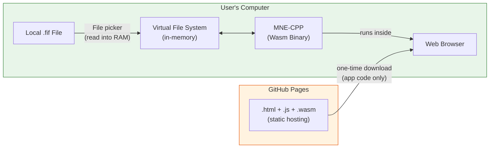

# MNE-CPP in the Browser — Online Applications

MNE-CPP can be compiled to [WebAssembly (Wasm)](https://webassembly.org/), which means that several of its GUI applications can run **directly inside a standard web browser** — no download, no installation, and no platform-specific binaries required. Users simply open a URL and start working.

:::tip Try MNE Browse Online
**[Launch MNE Browse in your browser](https://mne-cpp.github.io/wasm/mne_browse.html)** — an experimental, fully functional build of MNE Browse running as a WebAssembly application. Load your `.fif` files directly in the browser and explore raw MEG/EEG data — no installation required, no data uploaded.
:::

---

## What Is WebAssembly?

WebAssembly (abbreviated **Wasm**) is a low-level, portable binary instruction format that runs inside the **sandboxed runtime** of modern web browsers. It was designed by the W3C as a compilation target for languages like C, C++, and Rust, enabling near-native execution speed in the browser.

Key characteristics:

| Property | Description |
|---|---|
| **Portable** | Runs on any platform with a modern browser (Chrome, Firefox, Edge, Safari). |
| **Fast** | Executes at near-native speed — typically within 10–20 % of compiled C++ performance. |
| **Sandboxed** | Operates inside the browser's security sandbox with no direct access to the host file system, network, or hardware. |
| **No installation** | The application is loaded on demand; the user does not install or update anything. |

MNE-CPP's Wasm build is produced with the [Emscripten](https://emscripten.org/) toolchain and Qt's WebAssembly target. It supports **multi-threaded** execution on Chromium-based browsers and Firefox.

---

## Data Privacy — Your Data Never Leaves Your Computer {#data-privacy}

:::info Critical for clinical users
**No data are uploaded to any server.** When you open an MNE-CPP WebAssembly application in your browser, the entire application runs **locally on your machine**. The browser merely provides the runtime environment — comparable to a local virtual machine. All file I/O happens through the browser's in-memory virtual file system; data you load stay in your computer's RAM and are never transmitted over the network.
:::

Because MEG/EEG recordings frequently contain **Protected Health Information (PHI)** and **Personally Identifiable Information (PII)** — patient names, birth dates, hospital IDs, measurement dates, and more (see [MNE Anonymize](anonymize) for the full list) — data privacy is paramount. The WebAssembly architecture provides the following guarantees:

1. **Local execution only.** The Wasm binary is downloaded once (like any web page asset) and then executes entirely within the browser process on the user's device. There is no server-side processing of user data.
2. **No network upload of data files.** When you use the file picker to load a `.fif` file, the browser reads the file into local memory. The data are **not** sent to GitHub Pages, any MNE server, or any third party.
3. **Browser sandbox.** WebAssembly code cannot access arbitrary files on disk, cannot open network connections that the user has not initiated, and cannot bypass the browser's same-origin security policy.
4. **No telemetry on user data.** MNE-CPP's Wasm deployment is a set of static files hosted on GitHub Pages. There is no backend, no database, and no analytics that touch the loaded measurement data.

In short: **using MNE-CPP via WebAssembly in a browser is, from a data-flow perspective, equivalent to running a desktop application.** It simply uses the browser as a convenient, cross-platform runtime rather than requiring a native installation.

:::caution Anonymize before sharing
While the Wasm application itself does not upload data, always ensure that files are properly anonymized with [MNE Anonymize](anonymize) before transferring them to any third party — regardless of transport method.
:::

---

## Applications Available Online

The following sections summarize which MNE-CPP applications are available or planned for the browser and what functionality they provide. Each section also links to the full desktop documentation for the respective application.

### MNE Analyze — Offline Analysis in the Browser {#analyze}

| | |
|---|---|
|  | [**Full documentation**](analyze) &nbsp;·&nbsp; **[Launch in browser](https://mne-cpp.github.io/wasm/mne_analyze.html)** |

MNE Analyze is also available as a WebAssembly build. It provides a comprehensive, plugin-based GUI for sensor- and source-level analysis of pre-recorded MEG/EEG data, including:

- **Data loading** — Open `.fif` files through the browser's file dialog. Files are read into the browser's in-memory virtual file system and are **not uploaded anywhere**.
- **Raw data viewer** — Browse multi-channel time-series data with interactive scrolling, amplitude scaling, and channel grouping.
- **Filtering** — Apply real-time FIR/IIR filters to the loaded data for visualization and preprocessing.
- **Averaging** — Compute evoked responses from event-marked epochs.
- **Annotation manager** — Mark events, bad segments, and custom annotations.
- **Channel selection** — Select and group channels by type (MEG, EEG, etc.) or by region.
- **Scaling** — Adjust signal amplitude scaling per channel type.
- **Co-registration** — Align MEG sensor coordinates with MRI anatomy (where applicable).
- **Dipole fitting** — Interactive dipole fitting on evoked data.
- **Clinical and Research modes** — Switch between streamlined clinical and full research interfaces via the Appearance menu.
- **Dark and Default themes** — Visual style preferences for ergonomic extended use.

The modular plugin architecture means that the application can be extended and that individual plugins can be enabled or disabled at runtime.

:::note Experimental
The WebAssembly build of MNE Analyze is **experimental**. Some features available in the native desktop build — in particular Qt3D-based 3D visualization — are not yet supported in the browser due to WebAssembly platform limitations. The application is under active development and new capabilities are being added continuously.
:::

### MNE Browse — Raw Data Visualization {#browse}

| | |
|---|---|
|  | [**Full documentation**](browse-raw) &nbsp;·&nbsp; **[Launch in browser](https://mne-cpp.github.io/wasm/mne_browse.html)** |

MNE Browse (`mne_browse`) is the **featured online application**. It provides a focused, lightweight interface for browsing and visualizing raw MEG/EEG data stored in FIFF format — directly in the browser:

- **Interactive scrolling** through raw multi-channel data
- **Adjustable time scale and amplitude scaling**
- **Channel selection and grouping**
- **Real-time filtering display**
- **Bad channel marking**
- **Event / trigger visualization**
- **SSP projection toggling**

Because MNE Browse is intentionally lightweight and does not depend on Qt3D or OpenGL, it is particularly well suited for the WebAssembly platform. Simply open the link above, use the file dialog to load a `.fif` file from your local disk, and start browsing — **your data stay entirely on your machine**.

:::note Experimental
The WebAssembly build of MNE Browse is **experimental** and under active development. New capabilities are being added continuously.
:::

### MNE Inspect — 3D Brain Visualization {#inspect}

| | |
|---|---|
|  | [**Full documentation**](inspect) &nbsp;·&nbsp; **[Launch in browser](https://mne-cpp.github.io/wasm/mne_inspect.html)** |

MNE Inspect is a standalone 3D brain visualization and source analysis application, also available as an experimental WebAssembly build:

- FreeSurfer cortical surface rendering (inflated, pial, white, sphere, etc.)
- Atlas overlays (e.g., `aparc`, `aparc.a2009s`)
- BEM model layers (inner skull, outer skull, head)
- Source estimate (STC) visualization with animated playback and configurable colormaps
- Sensor and digitizer point display
- Functional connectivity network visualization
- Evoked sensor-field mapping with contour lines

:::note Experimental
The WebAssembly build of MNE Inspect is **experimental**. Some 3D rendering features may behave differently compared to the native desktop build due to WebAssembly platform constraints. The application is under active development.
:::

### MNE Anonymize — De-identification of Clinical Data {#anonymize}

| | |
|---|---|
| | [**Full documentation**](anonymize) |

MNE Anonymize (`mne_anonymize`) removes or substitutes Personal Health Information (PHI) and Personally Identifiable Information (PII) from FIFF files. It handles fields such as:

- Measurement dates and subject birthdays
- Subject name, ID, sex, handedness, weight, height
- Experimenter name
- Hospital Information System (HIS) IDs
- Project metadata
- Hardware MAC addresses embedded in file IDs
- Working directory and command-line information

MNE Anonymize supports both a graphical (GUI) and a command-line (CLI) mode. It implements the HIPAA Safe Harbor approach for de-identification and is designed so that the **output file is completely rewritten** — hidden or unlinked FIFF tags from the input file are never carried over.

Running MNE Anonymize as a **WebAssembly application in the browser** would be particularly powerful: a clinician or researcher could open a web page, drop in a FIFF file, anonymize it, and download the result — **all without any data ever leaving the local machine**. This use case is under consideration for future Wasm releases.

---

## How It Works — Technical Background

1. **One-time download.** When you navigate to the Wasm URL, the browser downloads the static `.html`, `.js`, and `.wasm` files from GitHub Pages (or any other static host). This is the application code — analogous to downloading an installer, but ephemeral.
2. **Local execution.** The browser's Wasm runtime compiles the binary to native machine code and executes it within its security sandbox. All computation — signal processing, filtering, averaging — happens on the user's CPU.
3. **File I/O through the virtual file system.** When a user selects a file, the browser reads it into an in-memory virtual file system that the Wasm application can access. Saving/exporting works via the browser's download mechanism.
4. **No server-side data processing.** GitHub Pages (or any static host) serves files and nothing else — there is no server-side logic, no database, and no data collection endpoint.

### Browser Requirements

| Requirement | Details |
|---|---|
| **Browser** | Chromium-based (Chrome, Edge, Brave, etc.) or Firefox. Safari has limited multi-threading support. |
| **HTTP headers** | Multi-threaded Wasm requires `Cross-Origin-Opener-Policy: same-origin` and `Cross-Origin-Embedder-Policy: require-corp`. These are set by the hosting configuration. |
| **Hardware** | Any modern desktop or laptop. More RAM is beneficial for large datasets. |

### Current Limitations

- **No 3D visualization.** Qt3D and `QOpenGLWidget` are not supported in WebAssembly builds. Applications requiring 3D rendering (MNE Inspect, 3D views in MNE Analyze) are excluded.
- **Static linking only.** The Wasm build uses `BUILD_SHARED_LIBS=OFF` — all libraries are linked statically into the final binary.
- **Initial load time.** The Wasm binary and supporting JavaScript can be several tens of megabytes. First load requires a reasonably fast connection; subsequent loads benefit from browser caching.
- **File size.** Very large FIFF files may approach browser memory limits, particularly on 32-bit browser processes.

---

## Building MNE-CPP for WebAssembly

If you want to build MNE-CPP for WebAssembly yourself — for development, testing, or self-hosting — see the developer documentation:

- **[WebAssembly Overview](../development/wasm)** — Architecture and limitations
- **[Build Guide](../development/wasm-buildguide)** — Step-by-step build instructions using Emscripten and Qt
- **[Testing via CI](../development/wasm-testing)** — Automated builds and deployment to GitHub Pages

---

## See Also

- [MNE Analyze](analyze) — Full desktop documentation
- [MNE Browse Raw](browse-raw) — Raw data browser documentation
- [MNE Inspect](inspect) — 3D visualization documentation
- [MNE Anonymize](anonymize) — De-identification tool documentation
- [Download Page](/download) — Native desktop installers and development packages
