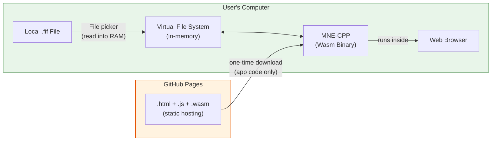

# Online Applications (WebAssembly)

MNE-CPP can be compiled to [WebAssembly (Wasm)](https://webassembly.org/), allowing several of its GUI applications to run inside a standard web browser without installation. Users open a URL, load local `.fif` files, and work with the data directly — no data are uploaded to any server.

:::caution Experimental builds
All WebAssembly builds listed on this page are **experimental** and under active development. Functionality may be incomplete or differ from the corresponding desktop applications. Bug reports and feedback are welcome.
:::

---

## What Is WebAssembly?

WebAssembly (abbreviated **Wasm**) is a low-level, portable binary instruction format that runs inside the **sandboxed runtime** of modern web browsers. It was designed by the W3C as a compilation target for languages like C, C++, and Rust, enabling near-native execution speed in the browser.

Key characteristics:

| Property | Description |
|---|---|
| **Portable** | Runs on any platform with a modern browser (Chrome, Firefox, Edge, Safari). |
| **Fast** | Executes at near-native speed — typically within 10–20 % of compiled C++ performance. |
| **Sandboxed** | Operates inside the browser's security sandbox with no direct access to the host file system, network, or hardware. |
| **No installation** | The application is loaded on demand; the user does not install or update anything. |

MNE-CPP's Wasm build is produced with the [Emscripten](https://emscripten.org/) toolchain and Qt's WebAssembly target. It supports **multi-threaded** execution on Chromium-based browsers and Firefox.

---

## Data Privacy {#data-privacy}

:::info
**No data are uploaded to any server.** The WebAssembly application runs locally within the browser process. File I/O is handled through the browser's in-memory virtual file system; loaded data remain in RAM and are not transmitted over the network.
:::

Because MEG/EEG recordings frequently contain **Protected Health Information (PHI)** and **Personally Identifiable Information (PII)** — patient names, birth dates, hospital IDs, measurement dates, and more (see [MNE Anonymize](tools-anonymize) for the full list) — data privacy is paramount. The WebAssembly architecture provides the following guarantees:

1. **Local execution only.** The Wasm binary is downloaded once (like any web page asset) and then executes entirely within the browser process on the user's device. There is no server-side processing of user data.
2. **No network upload of data files.** When you use the file picker to load a `.fif` file, the browser reads the file into local memory. The data are **not** sent to GitHub Pages, any MNE server, or any third party.
3. **Browser sandbox.** WebAssembly code cannot access arbitrary files on disk, cannot open network connections that the user has not initiated, and cannot bypass the browser's same-origin security policy.
4. **No telemetry on user data.** MNE-CPP's Wasm deployment is a set of static files hosted on GitHub Pages. There is no backend, no database, and no analytics that touch the loaded measurement data.

In summary, using MNE-CPP via WebAssembly is, from a data-flow perspective, equivalent to running a desktop application. The browser serves as a cross-platform runtime; it does not act as an intermediary for data transfer.

:::caution Anonymize before sharing
While the Wasm application itself does not upload data, always ensure that files are properly anonymized with [MNE Anonymize](tools-anonymize) before transferring them to any third party — regardless of transport method.
:::

---

## Applications Available Online

The following MNE-CPP applications are currently available as WebAssembly builds. Each section links to the full desktop documentation.

### MNE Analyze {#analyze}

  
  [Full documentation](analyze) &nbsp;·&nbsp; **[Launch in browser](https://mne-cpp.github.io/wasm/mne_analyze.html)**

MNE Analyze provides a plugin-based GUI for sensor- and source-level analysis of pre-recorded MEG/EEG data. The WebAssembly build supports:

- Loading `.fif` files via the browser file dialog (data remain in local memory)
- Multi-channel time-series browsing with scrolling, scaling, and channel grouping
- Real-time FIR/IIR filtering
- Epoch-based averaging (evoked responses)
- Annotation and event management
- Channel selection by type or region
- Co-registration and dipole fitting (where applicable)
- Clinical and Research interface modes

### MNE Browse {#browse}

  
  [Full documentation](browse-raw) &nbsp;·&nbsp; **[Launch in browser](https://mne-cpp.github.io/wasm/mne_browse.html)**

MNE Browse provides a lightweight interface for browsing raw MEG/EEG data in FIFF format. Supported features:

- Interactive scrolling through multi-channel time-series data
- Adjustable time scale and amplitude scaling
- Channel selection and grouping
- Real-time filtering display
- Bad channel marking
- Event / trigger visualization
- SSP projection toggling

### MNE Inspect {#inspect}

  
  [Full documentation](inspect) &nbsp;·&nbsp; **[Launch in browser](https://mne-cpp.github.io/wasm/mne_inspect.html)**

MNE Inspect is a 3D brain visualization and source analysis application. The WebAssembly build supports:

- FreeSurfer cortical surface rendering (inflated, pial, white, sphere, etc.)
- Atlas overlays (e.g., `aparc`, `aparc.a2009s`)
- BEM model layers (inner skull, outer skull, head)
- Source estimate (STC) visualization with animated playback
- Sensor and digitizer point display
- Functional connectivity network visualization
- Evoked sensor-field mapping

### MNE Anonymize {#anonymize}

  [Full documentation](tools-anonymize) &nbsp;·&nbsp; **[Launch in browser](https://mne-cpp.github.io/wasm/mne_anonymize.html)**

MNE Anonymize removes or substitutes Protected Health Information (PHI) and Personally Identifiable Information (PII) from FIFF files, following the HIPAA Safe Harbor approach. Handled fields include measurement dates, subject demographics, experimenter name, HIS IDs, project metadata, and hardware MAC addresses. The output file is completely rewritten — hidden or unlinked FIFF tags are never carried over.

The WebAssembly build allows loading, anonymizing, and downloading a FIFF file entirely within the browser, with no data leaving the local machine. See the [full documentation](tools-anonymize) for details on GUI and CLI modes.

---

## Technical Background

1. **One-time download.** When you navigate to the Wasm URL, the browser downloads the static `.html`, `.js`, and `.wasm` files from GitHub Pages (or any other static host). This is the application code — analogous to downloading an installer, but ephemeral.
2. **Local execution.** The browser's Wasm runtime compiles the binary to native machine code and executes it within its security sandbox. All computation — signal processing, filtering, averaging — happens on the user's CPU.
3. **File I/O through the virtual file system.** When a user selects a file, the browser reads it into an in-memory virtual file system that the Wasm application can access. Saving/exporting works via the browser's download mechanism.
4. **No server-side data processing.** GitHub Pages (or any static host) serves files and nothing else — there is no server-side logic, no database, and no data collection endpoint.

### Browser Requirements

| Requirement | Details |
|---|---|
| **Browser** | Chromium-based (Chrome, Edge, Brave, etc.) or Firefox. Safari has limited multi-threading support. |
| **HTTP headers** | Multi-threaded Wasm requires `Cross-Origin-Opener-Policy: same-origin` and `Cross-Origin-Embedder-Policy: require-corp`. These are set by the hosting configuration. |
| **Hardware** | Any modern desktop or laptop. More RAM is beneficial for large datasets. |

### Current Limitations

- **3D visualization.** The RHI-based `disp3D_rhi` library provides 3D rendering in the browser via WebGL. Some advanced 3D features may behave differently across browsers.
- **Static linking only.** The Wasm build uses `BUILD_SHARED_LIBS=OFF` — all libraries are linked statically into the final binary.
- **Initial load time.** The Wasm binary and supporting JavaScript can be several tens of megabytes. First load requires a reasonably fast connection; subsequent loads benefit from browser caching.
- **File size.** Very large FIFF files may approach browser memory limits, particularly on 32-bit browser processes.

---

## Building MNE-CPP for WebAssembly

If you want to build MNE-CPP for WebAssembly yourself — for development, testing, or self-hosting — see the developer documentation:

- **[WebAssembly Overview](/docs/development/wasm)** — Architecture and limitations
- **[Build Guide](/docs/development/wasm-buildguide)** — Step-by-step build instructions using Emscripten and Qt
- **[Testing via CI](/docs/development/wasm-testing)** — Automated builds and deployment to GitHub Pages

---

## See Also

- [MNE Analyze](analyze) — Full desktop documentation
- [MNE Browse Raw](browse-raw) — Raw data browser documentation
- [MNE Inspect](inspect) — 3D visualization documentation
- [MNE Anonymize](tools-anonymize) — De-identification tool documentation
- [Download Page](/download) — Native desktop installers and development packages
